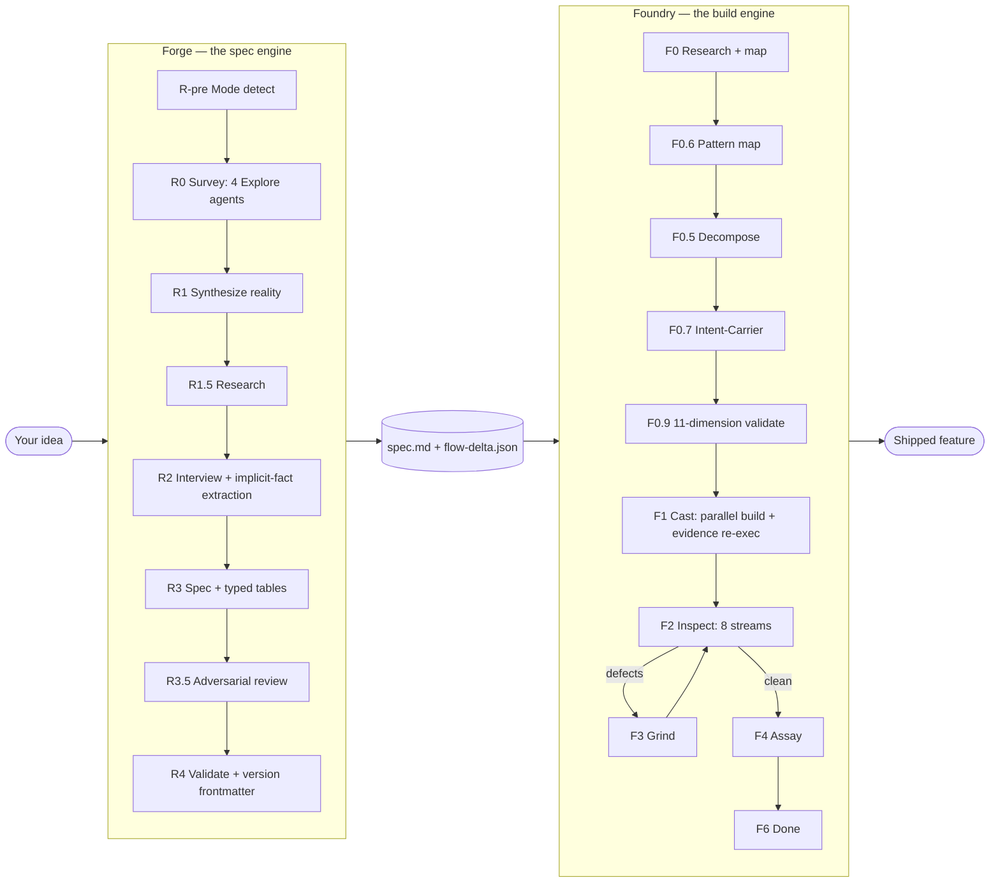
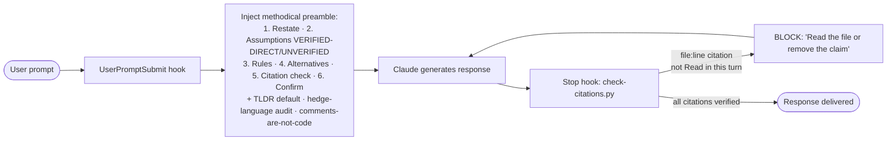

<p align="center">
  
</p>

<p align="center">
  <b>Forge plans. Foundry builds. adhoc keeps Claude honest in between.</b><br/>
  <i>A three-plugin marketplace for Claude Code — the spec engine, the build engine, and the always-on rule layer for ad-hoc work.</i>
</p>

<p align="center">
  
  
  
  
  
</p>

---

## Why Guild

Most AI coding tools either **ask and build in one breath** — producing code that drifts from what you actually wanted — or **plan in one context and execute in another**, producing plans that rot on the way to the executor. And the in-between — the ad-hoc back-and-forth where Claude races to a confident-sounding answer built on training-data inference — leaks confidently-wrong code citations into otherwise-careful work.

Guild splits the work cleanly across three plugins, each with one job:

- **Forge** runs a codebase-aware, ecosystem-grounded **interview** and produces a locked, verifiable spec.
- **Foundry** takes the locked spec and runs an **autonomous build-verify-fix loop** with mechanical drift prevention at every handoff.
- **adhoc** is the **always-on rule layer for ad-hoc work** — it injects a methodical pre-response checklist on every turn, and a Stop hook mechanically blocks responses with file:line citations Claude did not directly Read or Grep.

Forge and Foundry share one discipline: **plans are prompts**. What Forge writes is what Foundry reads, byte for byte. No interpretation layer, no paraphrasing, no "I'll just adjust the scope a little." The spec survives the trip. adhoc shares the same discipline at a smaller scale: it makes Claude show its work and verify its citations on every ad-hoc turn, so the answers you didn't run through a formal Forge→Foundry pipeline don't quietly drift either.

---

## The duo



Each plugin has one job and does it well. Forge does not build. Foundry does not interview. They communicate through a single shared artifact — the spec — and every mechanism in the marketplace exists to keep that artifact intact across the handoff.

---

## And adhoc — the always-on rule layer

While Forge and Foundry handle spec'd, contracted work, adhoc covers the gaps in between — the small asks, the exploratory bugs, the *"can you take a look at this?"* turns where you don't want to spin up a full spec. It runs on every conversation by default, as two cooperating hooks:



The preamble shapes the response (a nudge); the Stop hook verifies it (mechanical enforcement). Subagent (Task / Agent) calls do **not** count as verification — that's the failure mode this catches. Together: belt and suspenders against confidently-wrong-shaped answers built on training-data inference.

Forge plans. Foundry builds. adhoc keeps Claude honest in between.

---

## Quick start

```bash
# In Claude Code: add the marketplace and install all three plugins
claude plugin marketplace add alphabravo-oss/guild
claude plugin install forge@guild
claude plugin install foundry@guild
claude plugin install adhoc@guild

# Wire Foundry's MCP server into your target project
claude mcp add foundry -- uvx --from "git+https://github.com/alphabravo-oss/guild#subdirectory=plugins/foundry/mcp-server" foundry-mcp --project-root .
```

adhoc activates immediately — no further setup. Every new Claude conversation now runs the methodical preamble + citation Stop hook by default. `/adhoc:status` to inspect, `/adhoc:casual` to skip a trivial turn, `/adhoc:off` to silence the session.

Then, from inside your project:

```bash
# Step 1 — Forge interviews you and produces a spec
/forge:plan "add a workloads page that lists running pods with status and logs"

# ... Forge runs codebase research in parallel, then walks you through a
#     grounded interview, then writes spec.md (and flow-delta.json on
#     brownfield runs) ...

# Step 2 — Foundry takes the spec and builds it
/foundry:start pioneer --spec docs/specs/workloads-page.md
```

From `/foundry:start` onward, Foundry runs fully autonomous until it's done. No approval gates, no checkpoints, no "is this what you wanted?" It builds, verifies, grinds defects until they're gone, then assays the final result against the spec one more time.

---

## Forge — the spec engine

Forge conducts a **codebase-aware specification interview** and produces a foundry-ready spec with every requirement tagged, classified, and locked.

### What makes Forge different

- **Mode detection.** Every run is classified as `brownfield`, `greenfield`, or `cosmetic`. Brownfield runs produce a flow delta against the existing system. Greenfield runs produce an end-state spec. Cosmetic runs skip flow mapping entirely.
- **Parallel codebase research.** Before asking a single question, Forge spawns 4 Explore agents to survey your codebase (architecture, data, surface, infra) in parallel. The interviewer walks in already grounded.
- **R1.5 ecosystem research.** Targeted research into library versions, API shapes, and common gotchas for the feature category — so the interviewer never asks something it could have verified.
- **Brownfield flow grounding.** A `flow-mapper` agent produces a real, LSP-anchored graph of the existing system. The R2 interviewer walks the user through node-by-node hop confirmation, with the entrypoint user-confirmed before any hops are sketched. The output is a `flow-delta.json` of grounded hops, not a free-form end-state description.
- **Implicit-fact extraction (INTV-01).** During R2, the interviewer captures environmental facts the user states in passing — "we're on Postgres 14", "auth is JWT" — as `A-AUTO-NNN` entries with `[IMPLICIT_FACT:*]` tags. Foundry's intent-carrier then verifies every implicit fact survives the trip to a casting prompt.
- **Typed spec tables (TYPE-01).** R3 emits three structured tables — `## Global Invariants`, `## State Transitions`, `## Contracts` — instead of free-form prose. Each row carries a `[from A-NNN]` citation, and the entire table propagates byte-identical into every Foundry casting via `<invariants>` / `<state_transitions>` / `<contracts>` blocks. Phase 6 PROBE, Phase 7 TEST, and Phase 8 INTENT all key off these tables.
- **Versioned spec format (TYPE-02).** Every spec carries `spec_format_version: v2.1` in its frontmatter. Legacy `v2.0` specs continue to build unchanged; downstream agents (PROBE-01, TEST-01, INTENT-01) declare a minimum spec_format_version, and F0.5 DECOMPOSE emits `stream-skipped` records when the spec is older than an agent requires. No silent skews.
- **Spec type classification.** Every feature is tagged `GREENFIELD`, `MIGRATION`, `BUG_FIX`, or `REFACTOR`. Migration specs get enforced source-inventory enumeration: every symbol to port must be named explicitly, no wiggle-word "equivalent coverage" allowed.
- **Requirement classification.** Every item is tagged `Locked` (implement exactly), `Flexible` (teammate discretion), or `Informational` (context only). Foundry teammates honour the classification mechanically.
- **R3.5 adversarial spec review (PROBE-01).** Between R3 SPEC and R4 VALIDATE, an adversarial reviewer reads the draft as if a Foundry teammate would. Every ambiguity, missing citation, or contradictory `[from A-NNN]` chain becomes a `PROBE-NNN` finding. The author resolves them before SPEC FORGED — no half-finished spec reaches Foundry.
- **Verbatim-fidelity gate.** Locked requirements must quote the user verbatim with a transcript citation. The deterministic `validate-spec.py` gate refuses to finalize a spec until every Locked item is byte-identical to the source answer.
- **AskUserQuestion-driven interview.** Structured questions, structured answers — no free-form prompt parsing.

### Forge phases

| Phase | What it does |
|---|---|
| R-pre MODE DETECT | Classifies the run as `brownfield` / `greenfield` / `cosmetic` and confirms with the user |
| R0 SURVEY | 4 Explore agents map architecture, data, surface, and infra in parallel |
| R1 SYNTHESIZE | Merges survey outputs into `reality.md` |
| R1.5 RESEARCH | Targeted online research grounded in survey findings (library versions, ecosystem shapes) |
| R2 INTERVIEW | Adaptive interview with implicit-fact extraction; brownfield mode adds flow-graph + node-by-node hop confirmation |
| R3 SPEC | Writes the final `spec.md` with typed `## Global Invariants` / `## State Transitions` / `## Contracts` tables (plus `flow-delta.json` on brownfield runs) |
| R3.5 PROBE | Adversarial spec reviewer flags ambiguities, missing citations, and contradictory chains before SPEC FORGED |
| R4 VALIDATE | `validate-spec.py` verifies file references, citations, coverage, verbatim fidelity, and `spec_format_version` frontmatter |

---

## Foundry — the build engine

Foundry takes a spec and **autonomously** delivers a working feature, with mechanical verification and drift prevention at every layer.

### What makes Foundry different

- **"Plans are prompts" architecture.** Decompose authors every teammate prompt once at F0.5, saves it to disk, validates it against the master spec, and freezes it. The lead at F1/F3 is a router, not an interpreter — it never re-drafts, paraphrases, or edits teammate prompts. One source of truth, verified mechanically, handed off verbatim.
- **Drift-prevention sextet.** Every casting prompt carries six frozen source-of-truth blocks, byte-identical across every teammate in the run:
  - `<mandatory_rules>` — full CLAUDE.md / AGENTS.md / .cursorrules imperatives, extracted by the codebase mapper
  - `<global_invariants>` — cross-cutting spec rules (auth, validation, security, architectural placement)
  - `<invariants>` — the spec's typed `## Global Invariants` table, propagated row-for-row
  - `<state_transitions>` — the spec's typed `## State Transitions` table, propagated row-for-row
  - `<contracts>` — the spec's typed `## Contracts` table, propagated row-for-row
  - `<spec_requirements>` — the casting's specific spec slice (V2 mode only)
- **F0.6 PATTERN MAPPING.** Before decompose, a `pattern-mapper` agent walks every file the spec will touch and finds the closest analog already in the codebase. Each casting prompt then carries `<analog_pattern>` excerpts (Imports, Setup, Core, Error blocks with `file:line` citations) and `<shared_patterns>` for cross-cutting concerns. Teammates mirror real code, not abstract conventions.
- **F0.7 INTENT-CARRIER (INTENT-01).** Between F0.5 DECOMPOSE and F0.9 VALIDATE, the intent-carrier checks that every transcript `A-NNN` answer the user gave (including `[IMPLICIT_FACT:*]`-tagged ones) survives into at least one casting prompt. Dropped facts surface as `INTENT_DROPPED` defects and block F0.9. Specs older than `v2.1` skip this check; redecomposition is the fix path when an answer is dropped.
- **Brownfield packet-mode prompts.** When the spec carries a flow delta, teammates receive `<upstream_anchor>`, `<prerequisite_hops>`, `<this_hop>`, `<downstream_contract>`, and `<self_check>` blocks instead of an end-state description. There is no end-state to anchor backward from — the failure mode V3 is engineered to prevent.
- **11-dimension F0.9 validation.** A mechanical quality gate that runs before any code is written: requirement coverage, casting completeness, dependency correctness (no file overlap), key links planned, scope sanity, research integration, prompt fidelity (with `<global_invariants>`, `<mandatory_rules>`, and per-typed-table propagation sub-checks 7e/7g/7h/7i/7j, plus 7m intent coverage), migration coverage, spec structure, File-Change-Map ↔ key_files cross-check, and pattern compliance.
- **Server-side evidence re-execution (EVID-01).** When a teammate cites `evidence: $ pytest tests/foo.py` in its completion report, `Foundry-Accept-Casting` re-runs the command server-side, captures stdout/stderr, and stamps a provenance record. Hand-fabricated evidence cannot pass; the spec's evidence chain is mechanically verified.
- **Evidence-to-requirement binding (EVID-02).** Each evidence artifact in the completion report binds to a specific requirement ID. Acceptance refuses any requirement whose evidence binding is missing or stale, so "evidence exists for the casting" can never substitute for "evidence covers this exact requirement."
- **F2 INSPECT — up to 8 verification streams.** After teammates build, Foundry runs in parallel:
  - **TRACE** — LSP-powered upstream wiring (EXISTS → SUBSTANTIVE → WIRED → PLACED)
  - **FLOW_TRACE** — brownfield only; downstream wiring (PRODUCED → CONSUMES_UPSTREAM → SUBSTANTIVE → CHAIN_INTACT)
  - **PROVE** — spec-to-code citation verification with stub detection
  - **RESEARCH_AUDIT** — checks code honours every research recommendation
  - **COVERAGE_DIFF** — 1:1 symbol check for MIGRATION specs
  - **SIGHT** — browser-based UI audit via Playwright
  - **TEST / PROBE** — full test suite + API smoke
  - **TEST_OBSERVATIONS (TEST-01)** — spec-only test derivation. Reads `## Contracts` table, generates Hypothesis property tests, runs them code-blind, emits a `test_observations` report. Catches contracts the implementation forgot to honour.
- **F3 GRIND loop.** Every defect becomes a task attached to the casting it belongs to. Teammates fix, Foundry re-verifies. No partial fixes, no deferred work.
- **F4 ASSAY.** After INSPECT is clean, four fresh-eyes agents re-read the spec, form expectations, *then* read the code. Catches stubs and hollow handlers that passed earlier checks.
- **Requirement-ID citation enforcement.** Before a casting is accepted, the teammate's completion report must cite a `file:line` proof for every requirement ID in its spec slice. Missing citations = rejected, re-dispatched.
- **Methodical teammate.** Teammates are tuned for correctness over wall-clock speed: read floor (depth before writing), approach deliberation (alternatives before committing), blast radius (consequences before editing), competing hypotheses (verification before fixing). CAST teammates deliberate; GRIND teammates stay surgical.
- **Stall watchdog.** The orchestrator tracks time between calls. If the lead sits silent for more than 3 minutes, the next call returns a visible `STALL DETECTED` warning that forces explicit re-engagement.

### Foundry phases

| Phase | What it does |
|---|---|
| F0 RESEARCH | Per-domain researcher agents + optional codebase mapping (extracts `MANDATORY_RULES.md`) |
| F0.6 PATTERN | `pattern-mapper` finds analog files for every spec target; emits `PATTERNS.md` for casting prompts |
| F0.5 DECOMPOSE | Authors castings + verbatim teammate prompts (V2 end-state mode or V3 packet mode) |
| F0.7 INTENT-CARRIER | Verifies every transcript `A-NNN` answer survives into a casting prompt (skipped on `< v2.1` specs) |
| F0.9 VALIDATE | 11-dimension mechanical gate before building |
| F1 CAST | Parallel wave-based building via teammates; `Foundry-Accept-Casting` re-runs cited evidence server-side |
| F2 INSPECT | Up to 8 parallel verification streams |
| F3 GRIND | Fix defects, re-inspect, repeat until clean |
| F4 ASSAY | Fresh-eyes final verification with stub detection |
| F5 TEMPER | Optional — micro-domain stress testing (`--temper`) |
| F5.5 NYQUIST | Optional — regression test generation (`--nyquist`) |
| F6 DONE | Shutdown, report, commit |

---

## adhoc — the always-on rule layer

adhoc is the runtime layer for everything that *isn't* a Forge→Foundry pipeline run. It treats the failure mode of ad-hoc work — Claude racing to a confident-sounding answer built on training-data inference — as a runtime problem, not a prompt-discipline problem.

### What makes adhoc different

- **Runtime enforcement, not memory.** CLAUDE.md and persisted memory are passive — read once, agreed with, quietly ignored when the next prompt feels simple. adhoc installs two hooks (`UserPromptSubmit` + `Stop`) that fire on every turn, so the rules can't be skipped.
- **Methodical preamble.** Every user prompt gets a six-step pre-response checklist injected: restate the task; mark assumptions `VERIFIED-DIRECT` (you Read it) vs `UNVERIFIED` (anything else, including subagent summaries); cite applicable CLAUDE.md / memory rules; surface alternatives with tradeoffs; run a citation check; confirm before edits.
- **Citation Stop hook.** A Python script (`check-citations.py`) scans every response for `path/to/file.ext:NUMBER` claims and cross-checks against this turn's `Read` / `Grep` tool calls. If a cited file wasn't Read or Grep'd by Claude directly in this turn, the hook **blocks the response** — Claude must Read the file or remove the claim. Subagent (Task / Agent) reads do **not** count as verification, since they happen in a separate context.
- **Hedge-language audit.** Words like *probably / likely / typically / generally / usually / by convention* are treated as tripwires for unverified inference. Claude must either verify or explicitly downgrade with *"I'm inferring without verifying — want me to Read first?"*
- **Comments are not code.** Doc comments, docstrings, package prose, and READMEs describe author intent, not current behavior. When verifying a claim, executable code is the evidence — not the comment above it.
- **TLDR by default.** Lead with the answer in 3–6 lines. Expand to full structured analysis only when the user asks or when the task itself is a comparison / design / decision that needs the structure.
- **Independent toggles.** `/adhoc:off` silences the preamble; `/adhoc:citations-off` disables the Stop hook. Different problems, different switches. `/adhoc:casual` skips the next turn only and auto-reverts.
- **`/adhoc:deep` skill.** When the always-on preamble isn't enough, `/adhoc:deep` runs a heavier seven-step methodical analysis pass (read-only).
- **`adhoc:second-opinion` subagent.** Spawn a fresh-context Claude to critique a plan or recommendation. Returns `CONCUR` / `CONCUR WITH CAVEATS` / `PUSH BACK` / `WRONG SHAPE`.
- **Offline test suite.** 10 cases covering the original Shiro-style citation failure, fenced-block skipping, subagent-laundering detection, diff-marker handling, off-mode short-circuit, and log-write behavior. All pass on a clean install.

---

## What makes Guild different

| Most AI coding tools | Guild |
|---|---|
| Ask and build in one breath | Interview → spec → autonomous build, cleanly separated |
| Planner rewrites the prompt for the executor | Plans are prompts — decompose authors once, verbatim everywhere |
| Drift prevention is prose discipline | Drift prevention is mechanical (F0.9 + Accept-Casting + byte-identical propagation) |
| "Looks done" = tests pass | "Looks done" = 11 validation dimensions + up to 8 inspect streams + fresh-eyes assay |
| User approves every phase | Fully autonomous from `/foundry:start` to F6 DONE |
| CLAUDE.md is loaded per agent and hoped-for | CLAUDE.md rules are extracted verbatim and propagated byte-identical into every casting, verified mechanically |
| End-state descriptions everywhere | Brownfield runs use grounded flow deltas — no end-state framing for teammates extending existing systems |
| Bugs are logged for later | Every defect becomes a casting-scoped grind task; no deferrals |
| Ad-hoc Claude races to a confident answer | adhoc preamble + Stop hook force verify-before-claim on every turn — confidently-wrong citations are mechanically blocked |
| Subagent says it Read the file → claim "verified" | adhoc rejects subagent summaries as evidence; only direct Read/Grep in the current turn counts |
| Comments and docstrings count as evidence | adhoc treats only executable code as evidence — comments describe intent, not behavior |

---

## What's new since v4.2.0

Eight orthogonal additions land on the v4.2.0 base — every one is "shipped, tests green, untested in a live cross-cohort matrix." The empirical milestone-level proof of combined defect-rate drop is tracked as Phase 9 / RUN-01 and is deferred until a real-run consolidation lands. Until then, treat each item as "verified by synthetic-fixture suite, not by ablation cohort."

| ID | What it adds | Where it lives |
|---|---|---|
| **INTV-01** | Interview elicits implicit environmental facts as `A-AUTO-NNN` entries with `[IMPLICIT_FACT:*]` tags before SPEC FORGED | Forge R2 |
| **TYPE-01** | V2 spec template gains typed `## Global Invariants` / `## State Transitions` / `## Contracts` markdown tables; rows propagate byte-identical into every casting | Forge R3 → Foundry F0.5 → casting prompt blocks |
| **TYPE-02** | `spec_format_version` frontmatter; legacy `v2.0` specs build unchanged; F0.5 emits `stream-skipped` records when downstream agents declare a higher minimum | Forge R4 → Foundry F0.5 |
| **EVID-01** | `Foundry-Accept-Casting` re-runs cited evidence commands server-side and stamps provenance | Foundry F1 acceptance |
| **EVID-02** | Step-11 completion report binds each evidence artifact to a specific requirement ID; missing binding = acceptance refused | Foundry F1 acceptance |
| **PROBE-01** | Adversarial spec reviewer at R3.5 flags ambiguities, missing citations, and contradictory `[from A-NNN]` chains before SPEC FORGED | Forge R3.5 |
| **TEST-01** | 8th F2 INSPECT stream reads spec only, derives Hypothesis property tests from `## Contracts`, runs them code-blind, emits `test_observations` | Foundry F2 |
| **INTENT-01** | F0.7 intent-carrier checks transcript `A-NNN` coverage in every casting prompt; `INTENT_DROPPED` blocks F0.9 and routes to redecomposition | Foundry F0.7 |

The eight additions touch six F0.9 sub-checks (7e/7g/7h/7i/7j/7m) and bring the validate gate from 9 dimensions to 11.

---

## Under the hood

Foundry's orchestration state lives in an MCP server written in Python, which the `foundry` Lead inside Claude Code calls at every phase transition via tools like `Foundry-Next`, `Foundry-Validate-Castings`, `Foundry-Spawn-Teammate`, `Foundry-Accept-Casting`, and `Foundry-Handoff`. Every casting prompt, every acceptance check, every handoff event is recorded in `foundry-archive/{run}/` under the target project — a full audit trail for every build.

Forge writes specs under `docs/specs/{feature-slug}/spec.md` using a structured template with frontmatter, tagged requirement IDs (`US-N`, `FR-N`, `NFR-N`, `AC-N`), requirement classification, and an embedded verbatim transcript appendix. Brownfield runs additionally write `flow-delta.json` alongside the spec. Foundry's F0.5 DECOMPOSE reads the spec (and flow delta, if present) as its sole source of truth.

---

## Update

```bash
claude plugin marketplace update guild
claude plugin update forge@guild
claude plugin update foundry@guild
claude plugin update adhoc@guild
```

## Versioning

See [GitHub releases](https://github.com/alphabravo-oss/guild/releases) for the full changelog.

## Contributing

Issues and pull requests welcome at [github.com/alphabravo-oss/guild](https://github.com/alphabravo-oss/guild). If you're adding a new validation dimension, drift-prevention mechanism, or inspect stream, open a discussion first — the "plans are prompts" architecture is load-bearing and worth preserving.

## License

MIT — see [LICENSE](./LICENSE).

---

<p align="center"><i>Forge plans. Foundry builds. adhoc keeps Claude honest. You ship.</i></p>
