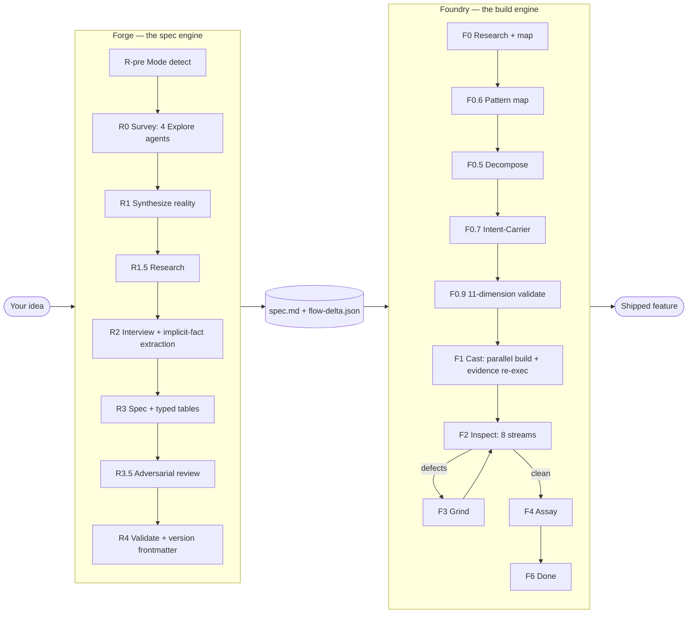
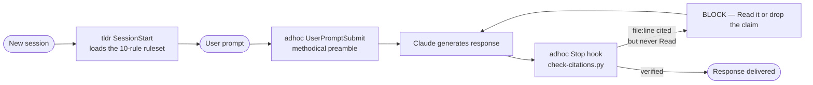

<p align="center">
  
</p>

<h1 align="center">Guild</h1>

<p align="center">
  <b>Forge plans. Foundry builds. adhoc keeps Claude honest in between.</b><br/>
  <i>Twelve plugins for Claude Code — a spec engine, a build engine, always-on rule layers,<br/>and a bench of specialists for review, cleanup, testing, and orchestration.</i>
</p>

<p align="center">
  <a href="#the-guild"></a>
  <a href="#quick-start"></a>
  <a href="./LICENSE"></a>
</p>

<p align="center">
  
  
  
  
  
  
  
  
  
  
  
  
</p>

<p align="center">
  <a href="#why-guild">Why Guild</a> ·
  <a href="#the-guild">The Guild</a> ·
  <a href="#quick-start">Quick start</a> ·
  <a href="#the-pipeline">The pipeline</a> ·
  <a href="#the-always-on-layer">Always-on layer</a> ·
  <a href="#the-reviewers">Reviewers</a> ·
  <a href="#the-workers">Workers</a> ·
  <a href="#what-makes-guild-different">Why it's different</a>
</p>

---

## Why Guild

Most AI coding tools either **ask and build in one breath** — producing code that drifts from what you actually wanted — or **plan in one context and execute in another**, producing plans that rot on the way to the executor. And the in-between — the ad-hoc back-and-forth where Claude races to a confident-sounding answer built on training-data inference — leaks confidently-wrong code citations into otherwise-careful work.

Guild splits the work so each plugin has exactly one job, and the handoffs between them are mechanical rather than hopeful.

The load-bearing idea is three words: **plans are prompts**. What Forge writes is what Foundry reads, byte for byte. No interpretation layer, no paraphrasing, no "I'll just adjust the scope a little." The spec survives the trip. Every other plugin in the marketplace is an application of the same discipline at a different scale — make the rule mechanical, verify it at the runtime, and never trust a summary of work in place of the work.

> [!TIP]
> **New here?** Install `forge` + `foundry` for the full spec→build pipeline, and `adhoc` + `tldr` for the always-on layer that improves every other conversation. Everything else is a specialist you can add when you hit the problem it solves.

---

## The Guild

Twelve plugins in four families. Every one installs from the same marketplace.

### 🏗️ The pipeline — spec it, then build it

| Plugin | | What it does | Start with |
|---|---|---|---|
| **[forge](plugins/forge)** | `4.3.1` | Codebase-aware specification **interview**. Surveys your repo with 4 parallel agents, researches the ecosystem, interviews you, and emits a locked spec with typed invariant/transition/contract tables. | `/forge:plan <feature>` |
| **[foundry](plugins/foundry)** | `4.6.1` | Autonomous **build-verify-fix loop**. Decomposes the spec into castings, builds in parallel waves, runs up to 8 verification streams, grinds defects to zero, then assays with fresh eyes. | `/foundry:start` |
| **[crucible](plugins/crucible)** | `0.1.0` | **Foundry, mini.** The same build-verify-fix heart with no MCP server and no interview — you bring a structured spec, it builds it and refuses to let it drift. | `/crucible:build <spec>` |

### 🎯 The always-on layer — every turn, not just the spec'd ones

| Plugin | | What it does | Start with |
|---|---|---|---|
| **[adhoc](plugins/adhoc)** | `0.3.0` | Methodical-mode. Injects a pre-response checklist every turn, and a Stop hook **mechanically blocks** responses citing files Claude never Read. Plus an iterative two-tier critic gate. | Nothing — it's on |
| **[tldr](plugins/tldr)** | `0.1.0` | Response shaping. Loads a 10-rule ruleset into every new session: action first, numbered steps, one concrete next action, no preamble or sign-off. | Nothing — it's on |

### 🔍 The reviewers — report only, never edit

| Plugin | | What it does | Start with |
|---|---|---|---|
| **[holmes](plugins/holmes)** | `0.1.0` | Macro-architecture critique. Seven blind design lenses hunt package proliferation, missed sharing, helper sprawl, and accretion — then a skeptic tries to refute each finding as intentional. | `/holmes:review <target>` |
| **[ux-review](plugins/ux-review)** | `0.1.0` | Experiential UX review that **drives the running app** as a real user. Finds the defects a code read structurally cannot: wrong anchors, absent affordances, states that silently break. | `/ux-review:run` |
| **[damu](plugins/damu)** | `0.2.0` | De-AI My UI. Strips the ~19 signatures that make an interface read as "made by an AI in Tailwind" — font chaos, purple-on-black, neon gradient borders, recycled rocket icons. | `/damu:remediate` |

### 🛠️ The workers — hand them a job

| Plugin | | What it does | Start with |
|---|---|---|---|
| **[crew](plugins/crew)** | `0.2.0` | Throw a gnarly problem at an AI dev that **owns the outcome**. Five agents investigate, plan, execute, and verify — SSH into boxes, debug deploys, ship features. | `/crew:do <problem>` |
| **[tidy](plugins/tidy)** | `0.1.0` | Low-risk cleanup across 7 tracks — dedup, type consolidation, dead code, circular deps, weak types, error handling, AI slop. Auto-applies **HIGH-confidence only**, atomic commits. | `/tidy:run` |
| **[e2e](plugins/e2e)** | `0.1.0` | Playwright test authoring. Describe a flow; Claude drives a real browser, reads the accessibility tree, and emits a spec that passes — then keeps it passing. | `/e2e:init` |
| **[weave](plugins/weave)** | `0.1.0` | Authors dynamic **Workflow scripts** on demand. Classifies your task into an orchestration archetype, picks the fan-out topology, and validates the script before saving. | `/weave:make <task>` |

---

## Quick start

```bash
# Add the marketplace
claude plugin marketplace add alphabravo-oss/guild

# The core four
claude plugin install forge@guild
claude plugin install foundry@guild
claude plugin install adhoc@guild
claude plugin install tldr@guild

# Wire Foundry's MCP server into your target project
claude mcp add foundry -- uvx --from "git+https://github.com/alphabravo-oss/guild#subdirectory=plugins/foundry/mcp-server" foundry-mcp --project-root .
```

> [!NOTE]
> `adhoc` and `tldr` activate immediately — there is nothing to enable. Every new conversation gets the methodical preamble, the citation Stop hook, and the response ruleset by default. Both have independent off-switches: `/adhoc:off`, `/tldr:off`.

Then, from inside your project:

```bash
# Step 1 — Forge interviews you and produces a spec
/forge:plan "add a workloads page that lists running pods with status and logs"

# ... Forge runs codebase research in parallel, then walks you through a
#     grounded interview, then writes spec.md (and flow-delta.json on
#     brownfield runs) ...

# Step 2 — Foundry takes the spec and builds it
/foundry:start pioneer --spec docs/specs/workloads-page.md
```

From `/foundry:start` onward, Foundry runs fully autonomous until it's done. No approval gates, no checkpoints, no "is this what you wanted?" It builds, verifies, grinds defects until they're gone, then assays the final result against the spec one more time.

<details>
<summary><b>Installing the rest</b></summary>

```bash
claude plugin install crew@guild        # autonomous dev that owns the outcome
claude plugin install crucible@guild    # mini-foundry, no MCP, no interview
claude plugin install holmes@guild      # macro-architecture review
claude plugin install ux-review@guild   # experiential UX review
claude plugin install damu@guild        # de-AI my UI
claude plugin install tidy@guild        # 7-track low-risk cleanup
claude plugin install e2e@guild         # Playwright test authoring
claude plugin install weave@guild       # Workflow script authoring
```

`e2e`, `ux-review`, and `damu:remediate` drive a real browser and need the Playwright MCP server. `foundry` needs its MCP server (see above); `crucible` deliberately does not.

</details>

---

## The pipeline



Forge does not build. Foundry does not interview. They communicate through a single shared artifact — the spec — and every mechanism in the marketplace exists to keep that artifact intact across the handoff.

### Forge — the spec engine

Forge conducts a **codebase-aware specification interview** and produces a foundry-ready spec with every requirement tagged, classified, and locked.

- **Mode detection.** Every run is classified as `brownfield`, `greenfield`, or `cosmetic`. Brownfield runs produce a flow delta against the existing system. Greenfield runs produce an end-state spec. Cosmetic runs skip flow mapping entirely.
- **Parallel codebase research.** Before asking a single question, Forge spawns 4 Explore agents to survey your codebase (architecture, data, surface, infra) in parallel. The interviewer walks in already grounded.
- **R1.5 ecosystem research.** Targeted research into library versions, API shapes, and common gotchas for the feature category — so the interviewer never asks something it could have verified.
- **Brownfield flow grounding.** A `flow-mapper` agent produces a real, LSP-anchored graph of the existing system. The R2 interviewer walks the user through node-by-node hop confirmation, with the entrypoint user-confirmed before any hops are sketched. The output is a `flow-delta.json` of grounded hops, not a free-form end-state description.
- **Implicit-fact extraction (INTV-01).** During R2, the interviewer captures environmental facts the user states in passing — "we're on Postgres 14", "auth is JWT" — as `A-AUTO-NNN` entries with `[IMPLICIT_FACT:*]` tags. Foundry's intent-carrier then verifies every implicit fact survives the trip to a casting prompt.
- **Typed spec tables (TYPE-01).** R3 emits three structured tables — `## Global Invariants`, `## State Transitions`, `## Contracts` — instead of free-form prose. Each row carries a `[from A-NNN]` citation, and the entire table propagates byte-identical into every Foundry casting.
- **Verbatim-fidelity gate.** Locked requirements must quote the user verbatim with a transcript citation. The deterministic `validate-spec.py` gate refuses to finalize a spec until every Locked item is byte-identical to the source answer.

<details>
<summary><b>Forge phases (R-pre → R4)</b></summary>

| Phase | What it does |
|---|---|
| R-pre MODE DETECT | Classifies the run as `brownfield` / `greenfield` / `cosmetic` and confirms with the user |
| R0 SURVEY | 4 Explore agents map architecture, data, surface, and infra in parallel |
| R1 SYNTHESIZE | Merges survey outputs into `reality.md` |
| R1.5 RESEARCH | Targeted online research grounded in survey findings (library versions, ecosystem shapes) |
| R2 INTERVIEW | Adaptive interview with implicit-fact extraction; brownfield mode adds flow-graph + node-by-node hop confirmation |
| R3 SPEC | Writes the final `spec.md` with typed `## Global Invariants` / `## State Transitions` / `## Contracts` tables (plus `flow-delta.json` on brownfield runs) |
| R3.5 PROBE | Adversarial spec reviewer flags ambiguities, missing citations, and contradictory chains before SPEC FORGED |
| R4 VALIDATE | `validate-spec.py` verifies file references, citations, coverage, verbatim fidelity, and `spec_format_version` frontmatter |

Additional detail: **spec type classification** (`GREENFIELD` / `MIGRATION` / `BUG_FIX` / `REFACTOR`, with enforced source-inventory enumeration on migrations), **requirement classification** (`Locked` / `Flexible` / `Informational`, honoured mechanically by Foundry teammates), **versioned spec format** (`spec_format_version: v2.1`; legacy `v2.0` specs build unchanged and downstream agents emit `stream-skipped` records rather than silently skewing), and an **AskUserQuestion-driven interview** — structured questions, structured answers, no free-form prompt parsing.

</details>

### Foundry — the build engine

Foundry takes a spec and **autonomously** delivers a working feature, with mechanical verification and drift prevention at every layer.

- **"Plans are prompts" architecture.** Decompose authors every teammate prompt once at F0.5, saves it to disk, validates it against the master spec, and freezes it. The lead at F1/F3 is a router, not an interpreter — it never re-drafts, paraphrases, or edits teammate prompts.
- **Drift-prevention sextet.** Every casting prompt carries six frozen source-of-truth blocks, byte-identical across every teammate in the run: `<mandatory_rules>`, `<global_invariants>`, `<invariants>`, `<state_transitions>`, `<contracts>`, `<spec_requirements>`.
- **F0.6 pattern mapping.** Before decompose, a `pattern-mapper` agent finds the closest analog already in your codebase for every file the spec will touch. Teammates mirror real code with `file:line` citations, not abstract conventions.
- **11-dimension F0.9 validation.** A mechanical quality gate that runs *before any code is written* — requirement coverage, casting completeness, dependency correctness, prompt fidelity, migration coverage, pattern compliance, and more.
- **Server-side evidence re-execution (EVID-01).** When a teammate cites `evidence: $ pytest tests/foo.py`, Foundry **re-runs the command server-side** and stamps a provenance record. Hand-fabricated evidence cannot pass.
- **Evidence-to-requirement binding (EVID-02).** Each artifact binds to a specific requirement ID, so "evidence exists for the casting" can never substitute for "evidence covers this exact requirement."

> [!IMPORTANT]
> Foundry is **fully autonomous from `/foundry:start` to F6 DONE.** There are no approval gates. Every casting prompt, acceptance check, and handoff event is recorded in `foundry-archive/{run}/` for audit.

<details>
<summary><b>Foundry phases (F0 → F6) and the 8 inspect streams</b></summary>

| Phase | What it does |
|---|---|
| F0 RESEARCH | Per-domain researcher agents + optional codebase mapping (extracts `MANDATORY_RULES.md`) |
| F0.6 PATTERN | `pattern-mapper` finds analog files for every spec target; emits `PATTERNS.md` for casting prompts |
| F0.5 DECOMPOSE | Authors castings + verbatim teammate prompts (V2 end-state mode or V3 packet mode) |
| F0.7 INTENT-CARRIER | Verifies every transcript `A-NNN` answer survives into a casting prompt (skipped on `< v2.1` specs) |
| F0.9 VALIDATE | 11-dimension mechanical gate before building |
| F1 CAST | Parallel wave-based building via teammates; `Foundry-Accept-Casting` re-runs cited evidence server-side |
| F2 INSPECT | Up to 8 parallel verification streams |
| F3 GRIND | Fix defects, re-inspect, repeat until clean |
| F4 ASSAY | Fresh-eyes final verification with stub detection |
| F5 TEMPER | Optional — micro-domain stress testing (`--temper`) |
| F5.5 NYQUIST | Optional — regression test generation (`--nyquist`) |
| F6 DONE | Shutdown, report, commit |

**The 8 F2 INSPECT streams**, run in parallel:

| Stream | Verifies |
|---|---|
| **TRACE** | LSP-powered upstream wiring (EXISTS → SUBSTANTIVE → WIRED → PLACED) |
| **FLOW_TRACE** | Brownfield only; downstream wiring (PRODUCED → CONSUMES_UPSTREAM → SUBSTANTIVE → CHAIN_INTACT) |
| **PROVE** | Spec-to-code citation verification with stub detection |
| **RESEARCH_AUDIT** | Code honours every research recommendation |
| **COVERAGE_DIFF** | 1:1 symbol check for MIGRATION specs |
| **SIGHT** | Browser-based UI audit via Playwright |
| **TEST / PROBE** | Full test suite + API smoke |
| **TEST_OBSERVATIONS** | Spec-only test derivation — reads the `## Contracts` table, generates Hypothesis property tests, runs them **code-blind** |

Plus: **brownfield packet-mode prompts** (`<upstream_anchor>` / `<prerequisite_hops>` / `<this_hop>` / `<downstream_contract>` / `<self_check>` instead of an end-state description), **requirement-ID citation enforcement** at acceptance, **methodical teammates** (read floor, approach deliberation, blast radius, competing hypotheses), and a **stall watchdog** that forces re-engagement if the lead sits silent for 3 minutes.

</details>

---

## The always-on layer

Forge and Foundry handle spec'd, contracted work. **adhoc** and **tldr** cover everything else — the small asks, the exploratory bugs, the *"can you take a look at this?"* turns where you don't want to spin up a full spec.

Both run by default on every conversation. Neither asks to be invoked, because a rule you have to remember to turn on is a rule you get on the turns you were already being careful.



| | **[adhoc](plugins/adhoc)** | **[tldr](plugins/tldr)** |
|---|---|---|
| **Governs** | How Claude *thinks* before answering | The *shape* of what comes out |
| **Enforces** | Read floor, alternatives, blast radius, verified citations, no hedge-laundering | Action first, numbered steps, one next action, no preamble or sign-off |
| **Mechanism** | Per-turn preamble + Stop-hook gates | Session-load ruleset + per-turn state check |
| **Prevents** | A confident, wrong answer | A correct answer you have to mine for |
| **Off-switch** | `/adhoc:off`, `/adhoc:casual` | `/tldr:off`, `/tldr:verbose` |

### What makes adhoc different

- **Runtime enforcement, not memory.** CLAUDE.md and persisted memory are passive — read once, agreed with, quietly ignored when the next prompt feels simple. adhoc installs hooks that fire on every turn, so the rules can't be skipped.
- **Citation Stop hook.** `check-citations.py` scans every response for `path/to/file.ext:NUMBER` claims and cross-checks against this turn's `Read`/`Grep` calls. If a cited file wasn't Read directly in this turn, the hook **blocks the response**. Subagent reads do **not** count — they happen in a separate context, and laundering a subagent summary into a confident citation is exactly the failure mode this catches.
- **Hedge-language audit.** *Probably / likely / typically / generally / by convention* are treated as tripwires for unverified inference. Verify, or explicitly downgrade the claim.
- **Comments are not code.** Docstrings and READMEs describe author intent, not current behavior. Executable code is the evidence.
- **Iterative critic gate.** Substantive responses must pass a multi-round critic dialog — a cheap Haiku fast-critic for rounds 1–2, an Opus escalation for rounds 3–5, each running a 10-item compliance audit and checking whether the prior round's flags were actually *addressed* rather than rephrased.

### What makes tldr different

- **Always-on by default.** Prior art ([`ayghri/i-have-adhd`](https://github.com/ayghri/i-have-adhd), MIT) requires opting in with a flag file. Here, on is the default and off is the deliberate act.
- **A mechanical mid-session off-switch.** A SessionStart hook loads the ruleset once per session; a one-line UserPromptSubmit hook re-reads state every turn, so `/tldr:off` suspends it *immediately* rather than next session.
- **Rules are prose in one file.** [`rules/ruleset.md`](plugins/tldr/rules/ruleset.md) holds all 10 rules, six break-glass exceptions, and a pre-send delete pass. Edit that file to tune your own house style — both hooks pick it up.

---

## The reviewers

Three plugins that **report and never edit.** Each attacks a class of problem that the others structurally cannot see.

<details>
<summary><b>holmes — is this shaped right, or accreted?</b></summary>

The senior-engineer design critique, not bug-hunting or lint. `/holmes:review <target>` builds a grounded structural map, then runs **7 blind design lenses** as separate agents — package proliferation, missed sharing, helper sprawl, flow and layering, cohesion, naming consistency, accretion markers.

Every candidate finding is then **adversarially verified by a skeptic** whose job is to refute it as intentional, so plausible-but-wrong smells get dropped. A completeness critic re-lenses any in-scope area no finding touched. The output is a per-subsystem deliberate/mixed/accreted verdict with `file:line` evidence and an ordered reshaping plan.

An empty result is a valid honest outcome for a well-shaped target.

</details>

<details>
<summary><b>ux-review — drive the app, don't read the code</b></summary>

Reading source is a *code* review and structurally cannot find experience defects: a mode that doesn't do what its label claims, an overlay anchored to the viewport center instead of the point you chose, a feature that works on the default screen and silently breaks in another state, a table-stakes affordance that is simply absent.

`/ux-review:run` launches the app in a real browser, **self-configures** by discovering what the product is and who it's for, then builds a coverage grid — every screen × state × variant × viewport × input modality — and drives real jobs-to-be-done through five lenses: promise-vs-delivery, default-vs-buried, anchor/subject, every-state-not-the-happy-one, and what's-missing.

Adversarial states (empty / error / offline / slow / denied / first-run), a keyboard + screen-reader + mobile sweep, and a continuous console watch catch the silent failures.

</details>

<details>
<summary><b>damu — De-AI My UI</b></summary>

AI loves the same UI flavor every time: 4–5 competing fonts, purple-on-near-black, a parallax hero that means nothing, neon gradient borders, the same rocket/bolt/shield icons recycled like Pokémon evolutions, every section a 24px card with zero soul.

One catalog of ~19 slop signatures, two modes:

- `/damu:prevent` renders the catalog's fixes into a copy-pasteable anti-slop ruleset for your CLAUDE.md, so Claude stops generating slop in the first place. Writes no file.
- `/damu:remediate` drives Playwright to capture per-route screenshots plus extracted CSS facts (font counts, color clusters, WCAG contrast, radius/shadow distributions), then runs nine blind per-tell lenses and synthesizes a per-page deliberate/mixed/slop verdict.

The governing principle: **every tell is sometimes correct.** A finding is HIGH-confidence only when the choice looks unmotivated and uniform.

</details>

---

## The workers

<details>
<summary><b>crew — throw it a problem, it owns the outcome</b></summary>

Five Opus agents (router, scout, worker, critic, fresh-eyes) collaborate to investigate, plan, execute, and verify — SSH into systems, spin up infra, edit code, ship features, debug deploys, get airgap bundles working.

The worker **self-switches** between investigating, planning, executing, and verifying — one persistent persona, not five different ones. On stuck, it runs multi-agent reflexion (2–3 parallel variants plus a judge), which fixes Reflexion's degeneration-of-thought failure mode. Critic and fresh-eyes both produce mandatory **evidence ledgers of commands they actually ran**.

One checkpoint (plan approval) for side-effecting tasks, zero for pure investigation. `/crew:goal` sets a completion condition and loops unattended — enforced by a Stop hook that blocks the run from ending while the goal is unmet.

</details>

<details>
<summary><b>tidy — careful cleanup, HIGH-confidence only</b></summary>

Seven focused tracks run in parallel, read-only: deduplication, type consolidation, dead code removal, circular dependency untangling, type strengthening, error-handling cleanup, deprecated/AI-slop removal.

Each ranks its proposed changes `HIGH` / `MEDIUM` / `LOW` / `UNCERTAIN` and **auto-applies only HIGH-confidence low-risk changes**, running language-appropriate type checks, tests, and lints after each batch. Atomic git commits mean any failing check is one revert away. Refuses to run on a dirty tree. `--dry-run` is the default.

Guardrails: never merges code that just *looks* similar, never removes dynamically-imported or framework-convention code, never strips legitimate boundary types, never silences real error boundaries, never uses comments as the source of truth.

</details>

<details>
<summary><b>e2e — describe the flow, get a passing spec</b></summary>

`/e2e:init` scaffolds Playwright and registers the MCP server. `/e2e:write <flow>` drives a real browser to perform the flow and emits a green `*.spec.ts`. `/e2e:crawl` discovers every route and generates a smoke spec per route. `/e2e:matrix` produces a routes × roles suite with reused `storageState`. `/e2e:audit` runs the suite, reads `trace.zip` files, and triages failures by root cause.

The author skill enforces selector hygiene (`getByRole` over CSS), auto-wait discipline, and idempotent test design.

</details>

<details>
<summary><b>weave — author the Workflow script for you</b></summary>

`/weave:make <task>` classifies the task into an orchestration archetype, picks the right fan-out topology — **pipeline by default, a barrier only when one stage genuinely needs all prior results** — and authors a self-contained Workflow script that obeys the tool's hard rules: pure-literal meta block, schema'd agent returns instead of text parsing, adversarial-verify for findings, loop-until-dry for unknown-size work.

Every script passes `node --check` and a 12-point self-audit before it is saved. Running is opt-in; authoring and saving are not.

</details>

---

## What makes Guild different

| Most AI coding tools | Guild |
|---|---|
| Ask and build in one breath | Interview → spec → autonomous build, cleanly separated |
| Planner rewrites the prompt for the executor | Plans are prompts — decompose authors once, verbatim everywhere |
| Drift prevention is prose discipline | Drift prevention is mechanical (F0.9 + Accept-Casting + byte-identical propagation) |
| "Looks done" = tests pass | "Looks done" = 11 validation dimensions + up to 8 inspect streams + fresh-eyes assay |
| User approves every phase | Fully autonomous from `/foundry:start` to F6 DONE |
| CLAUDE.md is loaded per agent and hoped-for | CLAUDE.md rules are extracted verbatim and propagated byte-identical into every casting, verified mechanically |
| End-state descriptions everywhere | Brownfield runs use grounded flow deltas — no end-state framing for teammates extending existing systems |
| Bugs are logged for later | Every defect becomes a casting-scoped grind task; no deferrals |
| Ad-hoc Claude races to a confident answer | adhoc preamble + Stop hook force verify-before-claim on every turn |
| Subagent says it Read the file → claim "verified" | adhoc rejects subagent summaries as evidence; only direct Read/Grep in the current turn counts |
| Comments and docstrings count as evidence | Only executable code is evidence — comments describe intent, not behavior |
| A UI review reads the source | ux-review drives the running app; damu measures the rendered CSS |
| "Be concise" lives in CLAUDE.md and decays | tldr loads the ruleset at the runtime, every session, with a mechanical off-switch |

---

## Under the hood

<details>
<summary><b>Where state lives</b></summary>

**Foundry's** orchestration state lives in an MCP server written in Python, which the `foundry` Lead calls at every phase transition via tools like `Foundry-Next`, `Foundry-Validate-Castings`, `Foundry-Spawn-Teammate`, `Foundry-Accept-Casting`, and `Foundry-Handoff`. Every casting prompt, every acceptance check, every handoff event is recorded in `foundry-archive/{run}/` under the target project — a full audit trail for every build.

**Forge** writes specs under `docs/specs/{feature-slug}/spec.md` using a structured template with frontmatter, tagged requirement IDs (`US-N`, `FR-N`, `NFR-N`, `AC-N`), requirement classification, and an embedded verbatim transcript appendix. Brownfield runs additionally write `flow-delta.json`. Foundry's F0.5 DECOMPOSE reads the spec as its sole source of truth.

**adhoc** and **tldr** keep session state in dotfiles under `~/.claude/` — `.adhoc-state`, `.adhoc-citations-mode`, `.tldr-state`, and friends — so toggles survive `/clear` and compaction. adhoc also appends every gate decision to `.adhoc-citations-log.jsonl` for post-hoc auditing of false positives.

**crew** keeps run state in `.crew/runs/` for resume; **tidy** and **damu** commit atomically so any applied change is one revert away.

</details>

<details>
<summary><b>What's new since v4.2.0</b></summary>

Eight orthogonal additions land on the v4.2.0 base. Every one is "shipped, tests green, untested in a live cross-cohort matrix." The empirical milestone-level proof of combined defect-rate drop is tracked as Phase 9 / RUN-01 and is deferred until a real-run consolidation lands. Until then, treat each item as **verified by synthetic-fixture suite, not by ablation cohort.**

| ID | What it adds | Where it lives |
|---|---|---|
| **INTV-01** | Interview elicits implicit environmental facts as `A-AUTO-NNN` entries with `[IMPLICIT_FACT:*]` tags before SPEC FORGED | Forge R2 |
| **TYPE-01** | V2 spec template gains typed `## Global Invariants` / `## State Transitions` / `## Contracts` tables; rows propagate byte-identical into every casting | Forge R3 → Foundry F0.5 |
| **TYPE-02** | `spec_format_version` frontmatter; legacy `v2.0` specs build unchanged; F0.5 emits `stream-skipped` records when downstream agents declare a higher minimum | Forge R4 → Foundry F0.5 |
| **EVID-01** | `Foundry-Accept-Casting` re-runs cited evidence commands server-side and stamps provenance | Foundry F1 acceptance |
| **EVID-02** | Completion report binds each evidence artifact to a specific requirement ID; missing binding = acceptance refused | Foundry F1 acceptance |
| **PROBE-01** | Adversarial spec reviewer at R3.5 flags ambiguities, missing citations, and contradictory `[from A-NNN]` chains | Forge R3.5 |
| **TEST-01** | 8th F2 INSPECT stream reads spec only, derives Hypothesis property tests from `## Contracts`, runs them code-blind | Foundry F2 |
| **INTENT-01** | F0.7 intent-carrier checks transcript `A-NNN` coverage in every casting prompt; `INTENT_DROPPED` blocks F0.9 | Foundry F0.7 |

The eight additions touch six F0.9 sub-checks (7e/7g/7h/7i/7j/7m) and bring the validate gate from 9 dimensions to 11.

</details>

---

## Update

```bash
claude plugin marketplace update guild
claude plugin update forge@guild
claude plugin update foundry@guild
claude plugin update adhoc@guild
claude plugin update tldr@guild
```

## Versioning

See [GitHub releases](https://github.com/alphabravo-oss/guild/releases) for the full changelog.

## Contributing

Issues and pull requests welcome at [github.com/alphabravo-oss/guild](https://github.com/alphabravo-oss/guild).

> [!WARNING]
> If you're adding a new validation dimension, drift-prevention mechanism, or inspect stream, **open a discussion first.** The "plans are prompts" architecture is load-bearing and worth preserving.

## License

MIT — see [LICENSE](./LICENSE).

---

<p align="center">
  <i>Forge plans. Foundry builds. adhoc keeps Claude honest. tldr says it in one line.<br/><b>You ship.</b></i>
</p>
