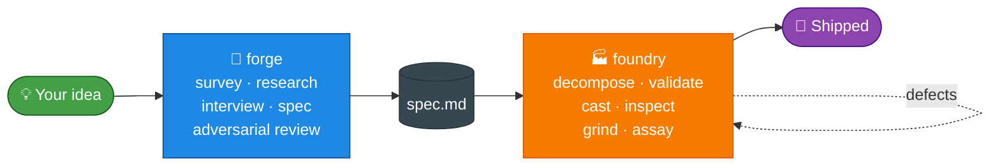
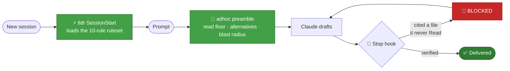

<div align="center">


<br/>

**12 plugins for Claude Code.** A spec engine, a build engine, two always-on rule layers, and a bench of specialists.

<br/>

<a href="#-quick-start"></a>
<a href="#-the-guild"></a>
<a href="#-deeper"></a>
<a href="./LICENSE"></a>

<a href="https://github.com/alphabravo-oss/guild/stargazers"></a>
<a href="https://github.com/alphabravo-oss/guild/issues"></a>


<br/>

<a href="#-the-guild">Plugins</a> · <a href="#-quick-start">Quick start</a> · <a href="#-how-it-works">How it works</a> · <a href="#-why-guild">Why</a> · <a href="#-deeper">Deeper</a>

</div>

---

<div align="center">

## 🧩 The Guild

<table>
<tr>
<td width="25%" align="center" valign="top">
<h2>📐</h2>
<b><a href="plugins/forge">forge</a></b><br/>
<sub>Interviews you.<br/>Emits a locked spec.</sub><br/><br/>
<code>/forge:plan</code>
</td>
<td width="25%" align="center" valign="top">
<h2>🏭</h2>
<b><a href="plugins/foundry">foundry</a></b><br/>
<sub>Builds the spec.<br/>Fully autonomous.</sub><br/><br/>
<code>/foundry:start</code>
</td>
<td width="25%" align="center" valign="top">
<h2>⚗️</h2>
<b><a href="plugins/crucible">crucible</a></b><br/>
<sub>Foundry, mini.<br/>No MCP, no interview.</sub><br/><br/>
<code>/crucible:build</code>
</td>
<td width="25%" align="center" valign="top">
<h2>🤖</h2>
<b><a href="plugins/crew">crew</a></b><br/>
<sub>Owns the outcome.<br/>Five agents, one persona.</sub><br/><br/>
<code>/crew:do</code>
</td>
</tr>
<tr>
<td align="center" valign="top">
<h2>🧭</h2>
<b><a href="plugins/adhoc">adhoc</a></b><br/>
<sub>Blocks citations<br/>it never verified.</sub><br/><br/>
<code>always on</code>
</td>
<td align="center" valign="top">
<h2>⚡</h2>
<b><a href="plugins/tldr">tldr</a></b><br/>
<sub>Action first.<br/>No preamble.</sub><br/><br/>
<code>always on</code>
</td>
<td align="center" valign="top">
<h2>🔍</h2>
<b><a href="plugins/holmes">holmes</a></b><br/>
<sub>Shaped right,<br/>or accreted?</sub><br/><br/>
<code>/holmes:review</code>
</td>
<td align="center" valign="top">
<h2>👁️</h2>
<b><a href="plugins/ux-review">ux-review</a></b><br/>
<sub>Drives the app.<br/>Doesn't read code.</sub><br/><br/>
<code>/ux-review:run</code>
</td>
</tr>
<tr>
<td align="center" valign="top">
<h2>🎨</h2>
<b><a href="plugins/damu">damu</a></b><br/>
<sub>De-AI my UI.<br/>19 slop signatures.</sub><br/><br/>
<code>/damu:remediate</code>
</td>
<td align="center" valign="top">
<h2>🧹</h2>
<b><a href="plugins/tidy">tidy</a></b><br/>
<sub>7-track cleanup.<br/>HIGH-confidence only.</sub><br/><br/>
<code>/tidy:run</code>
</td>
<td align="center" valign="top">
<h2>🎭</h2>
<b><a href="plugins/e2e">e2e</a></b><br/>
<sub>Describe the flow.<br/>Get a passing spec.</sub><br/><br/>
<code>/e2e:write</code>
</td>
<td align="center" valign="top">
<h2>🕸️</h2>
<b><a href="plugins/weave">weave</a></b><br/>
<sub>Authors Workflow<br/>scripts on demand.</sub><br/><br/>
<code>/weave:make</code>
</td>
</tr>
</table>

<sub>           </sub>

</div>

---

## ⚡ Quick start

```bash
claude plugin marketplace add alphabravo-oss/guild
claude plugin install forge@guild foundry@guild adhoc@guild tldr@guild
```

```bash
/forge:plan "workloads page listing running pods with status and logs"   # → spec.md
/foundry:start pioneer --spec docs/specs/workloads-page.md               # → shipped
```

> [!NOTE]
> `adhoc` and `tldr` need no setup — they are live on your next session. `foundry` needs its MCP server:
> `claude mcp add foundry -- uvx --from "git+https://github.com/alphabravo-oss/guild#subdirectory=plugins/foundry/mcp-server" foundry-mcp --project-root .`

<details>
<summary><b>Install the other eight</b></summary>

```bash
claude plugin install crucible@guild holmes@guild ux-review@guild damu@guild
claude plugin install crew@guild tidy@guild e2e@guild weave@guild
```

`e2e`, `ux-review`, and `damu:remediate` drive a real browser and want the Playwright MCP server.

</details>

---

## 🔄 How it works



**Forge does not build. Foundry does not interview.** They talk through one artifact — the spec — and every mechanism in the repo exists to keep it intact across that handoff.

---

## 💡 Why Guild

<table>
<tr><th align="left" width="50%">Most AI coding tools</th><th align="left" width="50%">Guild</th></tr>
<tr><td>Ask and build in one breath</td><td>Interview → spec → autonomous build</td></tr>
<tr><td>Planner rewrites the prompt for the executor</td><td><b>Plans are prompts</b> — authored once, verbatim everywhere</td></tr>
<tr><td>Drift prevention is prose discipline</td><td>Drift prevention is <b>mechanical</b> — byte-identical propagation, verified at a gate</td></tr>
<tr><td>"Looks done" = tests pass</td><td>11 validation dimensions + 8 inspect streams + fresh-eyes assay</td></tr>
<tr><td>User approves every phase</td><td>Autonomous from <code>/foundry:start</code> to done</td></tr>
<tr><td>Claims a file says X</td><td>Hook <b>blocks the response</b> if Claude never Read it</td></tr>
<tr><td>Subagent summary counts as "verified"</td><td>Only direct Read/Grep this turn counts</td></tr>
<tr><td>A UI review reads the source</td><td>ux-review drives the running app; damu measures rendered CSS</td></tr>
<tr><td>"Be concise" lives in CLAUDE.md and decays</td><td>tldr loads the ruleset at the runtime, every session</td></tr>
</table>

---

## 📚 Deeper

<details>
<summary><b>📐 forge — the spec engine</b></summary>

<br/>

4 parallel Explore agents survey your codebase before a single question is asked. Then targeted ecosystem research, then an `AskUserQuestion`-driven interview that captures facts you state in passing (*"we're on Postgres 14"*) as tagged `A-AUTO-NNN` entries.

Output is a spec with typed `## Global Invariants` / `## State Transitions` / `## Contracts` tables — every row citing `[from A-NNN]` — that propagate byte-identical into every Foundry casting.

| Phase | Does |
|---|---|
| `R-pre` | Classify brownfield / greenfield / cosmetic |
| `R0` | 4 Explore agents map architecture, data, surface, infra |
| `R1` → `R1.5` | Synthesize `reality.md`, then ecosystem research |
| `R2` | Interview + implicit-fact extraction (brownfield adds node-by-node flow confirmation) |
| `R3` → `R3.5` | Write spec, then an adversarial reviewer hunts ambiguity |
| `R4` | `validate-spec.py` — citations, coverage, verbatim fidelity |

**Verbatim-fidelity gate:** Locked requirements must quote you word-for-word with a transcript citation, or the spec refuses to finalize.

→ [Full docs](plugins/forge)

</details>

<details>
<summary><b>🏭 foundry — the build engine</b></summary>

<br/>

Decompose authors every teammate prompt **once**, freezes it, and validates it against the spec. The lead is a router, not an interpreter — it never re-drafts or paraphrases.

| Phase | Does |
|---|---|
| `F0` → `F0.6` | Research, codebase map, pattern map (finds real analogs to mirror) |
| `F0.5` → `F0.7` | Decompose into castings, verify no user answer got dropped |
| `F0.9` | **11-dimension gate — before any code is written** |
| `F1` | Parallel wave build; cited evidence **re-run server-side** |
| `F2` | Up to **8 inspect streams** in parallel |
| `F3` | Grind every defect to zero, re-inspect |
| `F4` | Fresh-eyes assay with stub detection |

**The 8 streams:** `TRACE` (LSP upstream wiring) · `FLOW_TRACE` (downstream) · `PROVE` (spec-to-code) · `RESEARCH_AUDIT` · `COVERAGE_DIFF` · `SIGHT` (browser) · `TEST/PROBE` · `TEST_OBSERVATIONS` (derives property tests from the contracts table, runs them **code-blind**)

> [!IMPORTANT]
> Hand-fabricated evidence cannot pass. When a teammate cites `$ pytest tests/foo.py`, Foundry re-runs it server-side and stamps provenance — and each artifact binds to a specific requirement ID.

→ [Full docs](plugins/foundry)

</details>

<details>
<summary><b>🧭 adhoc + ⚡ tldr — the always-on layer</b></summary>

<br/>

Both fire on every conversation by default. A rule you have to remember to turn on is a rule you get on the turns you were already being careful.



| | 🧭 adhoc | ⚡ tldr |
|---|---|---|
| Governs | How Claude *thinks* | The *shape* of the output |
| Prevents | A confident, wrong answer | A right answer you must mine for |
| Off | `/adhoc:off` `/adhoc:casual` | `/tldr:off` `/tldr:verbose` |

**adhoc** treats *probably / likely / typically* as tripwires for unverified inference, refuses comments as evidence, and runs an iterative critic gate (Haiku rounds 1–2, Opus 3–5) that checks whether the last round's flags were actually fixed or just rephrased.

**tldr** keeps all 10 rules as prose in one file — [`rules/ruleset.md`](plugins/tldr/rules/ruleset.md) — so tuning your house style is a markdown edit, not a code change.

→ [adhoc docs](plugins/adhoc) · [tldr docs](plugins/tldr)

</details>

<details>
<summary><b>🔍 The reviewers — report only, never edit</b></summary>

<br/>

**🔍 holmes** runs 7 blind design lenses (package proliferation, missed sharing, helper sprawl, cohesion, accretion markers…) as separate agents, then a **skeptic tries to refute each finding as intentional** so plausible-but-wrong smells get dropped. An empty result is a valid honest outcome.

**👁️ ux-review** launches the app in a real browser and uses it. A code read structurally cannot find an overlay anchored to the viewport center instead of the point you clicked, or a feature that works on the default screen and silently breaks in another state. Sweeps adversarial states — empty, error, offline, slow, denied, first-run — plus keyboard, screen reader, and mobile.

**🎨 damu** catalogs ~19 AI-UI tells — font chaos, purple-on-near-black, neon gradient borders, recycled rocket icons, everything-is-a-24px-card. `prevent` gives you an anti-slop ruleset for CLAUDE.md; `remediate` measures the rendered CSS and reports per-page verdicts. Governing rule: **every tell is sometimes correct**, so HIGH confidence requires the choice to look unmotivated *and* uniform.

→ [holmes](plugins/holmes) · [ux-review](plugins/ux-review) · [damu](plugins/damu)

</details>

<details>
<summary><b>🛠️ The workers — hand them a job</b></summary>

<br/>

**🤖 crew** — five agents investigate, plan, execute, verify. SSH into boxes, run terraform, debug deploys. The worker self-switches modes instead of being five personas; critic and fresh-eyes must produce **evidence ledgers of commands they actually ran**. `/crew:goal` loops unattended until the goal is met.

**🧹 tidy** — 7 parallel read-only tracks, changes ranked HIGH/MEDIUM/LOW, **auto-applies HIGH-confidence only**, atomic commits, refuses a dirty tree. Never merges code that merely *looks* similar.

**🎭 e2e** — `init` scaffolds Playwright, `write` drives the browser and emits a green spec, `crawl` covers every route, `matrix` does routes × roles, `audit` reads `trace.zip` and triages by root cause.

**🕸️ weave** — classifies your task, picks the fan-out topology (pipeline by default, barrier only when a stage truly needs all prior results), and validates the script with `node --check` plus a 12-point audit before saving.

→ [crew](plugins/crew) · [tidy](plugins/tidy) · [e2e](plugins/e2e) · [weave](plugins/weave)

</details>

<details>
<summary><b>🗄️ Where state lives</b></summary>

<br/>

| Plugin | State |
|---|---|
| foundry | `foundry-archive/{run}/` — every prompt, acceptance check, and handoff. Full audit trail. |
| forge | `docs/specs/{slug}/spec.md` + `flow-delta.json` on brownfield runs |
| adhoc / tldr | dotfiles in `~/.claude/` — survive `/clear` and compaction. adhoc logs every gate decision to `.adhoc-citations-log.jsonl` |
| crew | `.crew/runs/` for resume |
| tidy / damu | atomic commits — any applied change is one revert away |

</details>

<details>
<summary><b>🆕 What's new since v4.2.0</b></summary>

<br/>

> [!NOTE]
> All eight are **verified by synthetic-fixture suite, not by ablation cohort.** Milestone-level proof of combined defect-rate drop is tracked as Phase 9 / RUN-01.

| ID | Adds | Where |
|---|---|---|
| `INTV-01` | Implicit environmental facts captured as `A-AUTO-NNN` | forge R2 |
| `TYPE-01` | Typed invariants / transitions / contracts tables, propagated byte-identical | forge R3 → foundry F0.5 |
| `TYPE-02` | `spec_format_version` frontmatter; legacy specs build unchanged | forge R4 |
| `EVID-01` | Cited evidence re-run server-side with provenance | foundry F1 |
| `EVID-02` | Each artifact binds to a requirement ID | foundry F1 |
| `PROBE-01` | Adversarial spec review before SPEC FORGED | forge R3.5 |
| `TEST-01` | 8th stream derives property tests from contracts, runs code-blind | foundry F2 |
| `INTENT-01` | Verifies no user answer got dropped in decomposition | foundry F0.7 |

Together they take the F0.9 gate from 9 dimensions to 11.

</details>

---

<div align="center">

**Update** — `claude plugin marketplace update guild`, then `claude plugin update <name>@guild`

**Contributing** — issues and PRs welcome. Adding a validation dimension, drift-prevention mechanism, or inspect stream? Open a discussion first — *plans are prompts* is load-bearing.

**License** — [MIT](./LICENSE)


<i>Forge plans. Foundry builds. adhoc keeps Claude honest. tldr says it in one line.<br/><b>You ship.</b></i>

</div>
