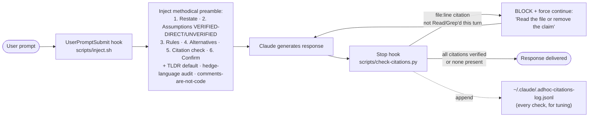

<p align="center">
  <b>adhoc</b> — methodical-mode for Claude Code.<br/>
  <i>Stops Claude from racing. Blocks citations it never verified.</i>
</p>

<p align="center">
  
  
  
  
</p>

<p align="center">
  <a href="../../README.md">← back to the Guild marketplace</a>
</p>

---

> **Stops Claude from racing.** An always-on UserPromptSubmit hook injects a methodical pre-response checklist into every turn — restate the task, mark assumptions VERIFIED-DIRECT or UNVERIFIED, cite CLAUDE.md and memory rules in play, surface alternatives, run a citation check, confirm before editing.
>
> **And mechanically catches what nudges miss.** A Stop hook scans every response for file:line citations and blocks any response that cites a file Claude did not Read in the same turn — catching the subagent-summary-laundered claims that preamble rules miss.

Forge plans. Foundry builds. **adhoc thinks before it answers.**

---

## Why adhoc

Most ad-hoc work with Claude looks like this:

> *"Add rate limiting to /auth/login."*
>
> Claude reads three files, installs a package, edits four more, runs the tests, declares done. Ninety seconds later you notice it ignored the rate limiter you already had, applied middleware to the wrong scope, and silently broke a test you weren't watching.

The model isn't dumb. It's **trained to feel productive** — start, do, finish. The default disposition is racing. CLAUDE.md and memory don't fix it because they're passive: read once, agreed with, quietly ignored when the next prompt feels simple.

adhoc fixes it the only way that actually works: **at the runtime, not the prompt.** Every user turn fires a hook that prepends a checklist Claude must walk before responding. The model can't ignore it because it isn't being asked to remember — it's being handed structure on every prompt.

---

## What it does

Two complementary hooks:



**1. `UserPromptSubmit` hook (the nudge).** Fires before Claude sees your message. Emits a methodical preamble that becomes part of the prompt context. Claude must walk the checklist briefly before answering.

```
[adhoc:methodical-mode active]

1. RESTATE          — One-sentence statement of what's being asked. Ask if ambiguous.
2. ASSUMPTIONS      — Mark VERIFIED-DIRECT (you Read it) or UNVERIFIED.
                      Subagent reports do NOT count as verification.
3. RULES            — Cite any CLAUDE.md / memory rule that applies, by name.
4. ALTERNATIVES     — Surface 2 approaches with tradeoffs before recommending.
5. CITATION CHECK   — List every file:line / signature / enum claim. Confirm
                      a Read or Grep happened in this turn. If not — Read now.
6. CONFIRM          — Multi-file or hard-to-revert? Plan first, wait for ack.

Default disposition: methodical over fast.
A wrong answer delivered quickly is still a wrong answer.
```

**2. `Stop` hook (the enforcement).** Fires when Claude finishes its response, before you see it. Scans for `path/to/file.ext:NUMBER` citations and cross-checks against this turn's `Read` / `Grep` tool calls. If any cited file wasn't Read or Grep'd by Claude directly in this turn, the hook **blocks the response** — Claude must Read the file (or remove the claim) before stopping. Subagent (Task / Agent) calls do **not** count as verification, since their internal Reads happen in a separate context — that's the failure mode this catches.

The preamble shapes the response; the Stop hook verifies it. Together: belt and suspenders against confident-wrong code citations.

---

## Install

```
/plugin marketplace add alphabravo-oss/guild
/plugin install adhoc@guild
```

After install, every new conversation runs methodical-mode by default. No further setup.

---

## Commands

| Command | Effect |
|---|---|
| `/adhoc:status` | Show current state of both hooks |
| `/adhoc:on` | Re-enable methodical-mode preamble for this session |
| `/adhoc:off` | Silence methodical-mode preamble for the rest of this session |
| `/adhoc:casual` | Skip methodical-mode preamble for the **next single turn** — auto-reverts |
| `/adhoc:citations-on` | Re-enable the Stop-hook citation verifier (default mode) |
| `/adhoc:citations-off` | Disable the Stop-hook citation verifier |
| `/adhoc:deep` | Run a heavier methodical analysis pass (read-only skill) |
| `/adhoc:help` | Inline reference |

The two hooks have **independent toggles**. `/adhoc:off` silences the preamble but the citation verifier keeps enforcing. `/adhoc:citations-off` disables the verifier but the preamble keeps firing. Different problems, different switches.

---

## /adhoc:deep — when the preamble isn't enough

For tasks that are non-trivial, ambiguous, or architectural, the always-on preamble is a floor. `/adhoc:deep` is a heavier pass — a read-only skill that walks Claude through seven structured steps:

1. **Restate** — what's being asked, what was said, what was likely meant, what else it could mean
2. **Assumptions** — at least 5, each marked VERIFIED or UNVERIFIED, each verified or asked
3. **Prior art** — search the codebase, CLAUDE.md, memory, recent git history for related decisions
4. **Alternatives** — at least 3 distinct approaches with concrete tradeoffs
5. **Edge cases** — failure modes of the preferred approach
6. **Recommend** — one approach, with reasons and rejected alternatives cited
7. **Stop-points** — where Claude will pause for confirmation during execution

Output is a written analysis. **Zero code changes.** You decide what to do with it.

Use it before architectural decisions, refactors that touch >2 files, ambiguous bug reports, or any time you'd say "think hard about this."

---

## adhoc:second-opinion — independent critique

A subagent with **no prior conversation context**. Spawn it via the Agent tool when you want a take from a Claude that hasn't anchored on the framing you've been working with.

```
Agent({
  subagent_type: "adhoc:second-opinion",
  description: "Review the migration approach",
  prompt: "Problem: ... Proposed approach: ... Constraints: ... Files: ..."
})
```

Returns a written critique with these sections:

- **Agreements** — what the spawner got right (calibrates the rest)
- **Disagreements** — where the reviewer would have decided differently, with code citations
- **Missed considerations** — edge cases, hidden assumptions, prior art the spawner skipped
- **Alternative approach** — if the reviewer has a materially different one
- **Verdict** — `CONCUR` / `CONCUR WITH CAVEATS` / `PUSH BACK` / `WRONG SHAPE`

Use it before merging a non-trivial PR you authored with Claude, or any time the conversation has been long and you want fresh eyes.

---

## State management

Two state files, one per hook:

**`~/.claude/.adhoc-state`** — methodical-mode preamble:

| Contents | Behavior |
|---|---|
| absent | methodical-mode **on** (default) |
| `off` | silenced for the session |
| `casual` | skipped on the next prompt, then auto-deleted (one-turn release valve) |

**`~/.claude/.adhoc-citations-mode`** — Stop-hook citation verifier:

| Contents | Behavior |
|---|---|
| absent / `default` | verifier **on** — blocks responses with unverified file:line citations |
| `off` | verifier disabled |

**`~/.claude/.adhoc-citations-log.jsonl`** — append-only log of every citation check (pass or block). Each line records timestamp, session ID, citations found, paths verified in the turn, and the decision. Useful for tuning the regex against real false-positive blocks if any surface in practice.

The toggle commands write/delete these files. The hooks read them before firing. No daemons, no background state.

---

## When to release-valve

The default is intentional. If you remembered to invoke it, you wouldn't need it. That said:

- **`/adhoc:casual`** — for trivial questions where the preamble is pure noise. Examples: *"what's the date,"* *"rename this variable,"* *"format this JSON."*
- **`/adhoc:off`** — for long pairing sessions where you've already calibrated and the preamble is repeating itself. Re-enable with `/adhoc:on` when you start a new task.

Don't disable it because the preamble feels chatty. **That's the working state.** Disable it when the preamble has stopped adding signal.

---

## Tuning

Knobs you might want later:

1. **The preamble itself** — `scripts/inject.sh`. Wording is opinionated. Soften, sharpen, or shorten to taste.
2. **The citation regex** — `scripts/check-citations.py`. Currently tier A only (`path/to/file.ext:NUMBER`). The `CITATION_RE` and `CODE_EXT` constants are the dials. To extend to bare paths or function signatures, add tiers and tests.
3. **False-positive log** — tail `~/.claude/.adhoc-citations-log.jsonl` after a week of real use. Any blocks against citations that turned out correct are signals to refine the regex.
4. **Always-on default** — to flip the preamble to off-by-default, change `inject.sh` to require an opt-in state file instead of treating absence as on.
5. **Project-scoped state** — `~/.claude/.adhoc-state` and `~/.claude/.adhoc-citations-mode` are global. Swap to `${CLAUDE_PROJECT_DIR}/.adhoc-...` in the scripts for per-project state.

## Tests

Offline test suite for the citation hook:

```
python3 plugins/adhoc/tests/test_check_citations.py
```

10 cases cover: the original Shiro-style failure, clean responses, citations in fenced code blocks, subagent-only Reads (the key failure mode), diff-line markers, bare path mentions, off-mode short-circuit, stop-hook-active loop avoidance, Grep verification, and log-write behavior. All ten pass on a clean install.

---

## Uninstall

```
/plugin uninstall adhoc@guild
rm -f ~/.claude/.adhoc-state ~/.claude/.adhoc-citations-mode ~/.claude/.adhoc-citations-log.jsonl
```

---

## Changelog

### v0.1.4

- **Comments are not code.** New closing rule: doc comments, inline comments, docstrings, package prose, and README descriptions describe what the author *intended* or what the code *used to do* — they are not current behavior. When verifying a claim, the executable code is the evidence: function bodies, control flow, return statements, conditionals, actual SQL, actual proto, actual route wiring. A comment saying "Returns nil on error" is not evidence the function does so. A docstring claiming validation is not evidence of validation. Comments rot; code is authoritative. If a comment and the code disagree, the code is right.

### v0.1.3

- **Hedge-language audit.** New closing rule in the preamble flags words like *probably / likely / typically / generally / usually / in this kind of project / I'd expect / common pattern / should be / tends to / by convention* as tripwires for unverified inference. When any of these appear in a substantive claim about the current codebase, Claude must either (a) Read/Grep to convert the hedge into a specific evidenced claim, or (b) explicitly downgrade with a disclosure ("I haven't Read this — I'm inferring; want me to verify first?"). Catches the failure mode that slips under the citation Stop hook — confident-shaped answers built on training-data pattern-matching when no specific `file:line` citations are made.

### v0.1.2

- **TLDR by default.** Added a closing rule to the preamble: lead with the answer in 3–6 lines or a few key bullets, expand to full structured analysis (tables, multi-section breakdowns, code walks, exhaustive caveats) only when the user explicitly asks ("walk me through", "full breakdown", "long form") or when the task itself is a comparison / design / decision that genuinely needs the structure. The methodical checklist (steps 1–6) becomes internal scaffolding to think clearly, not a template imposed on every visible response.

### v0.1.1

- **Tightened the preamble's evidence rule.** Step 2 now distinguishes `VERIFIED-DIRECT` (you Read it yourself in this turn) from `UNVERIFIED` (anything else, including subagent summaries). Subagent reports — `Explore`, `Task`, etc. — explicitly **do not** count as verification, since their internal reads happen in a separate context and their summaries can paraphrase, miss reservations, or hallucinate line numbers.
- **Added a CITATION CHECK step (step 5).** Before responding, Claude must list every file:line / signature / enum / RPC / schema claim and confirm a `Read` or `Grep` tool call in this turn touched the cited path. If not — Read it now or remove the claim.
- **Added a Stop hook (`scripts/check-citations.py`).** Mechanically scans every response for `path/to/file.ext:NUMBER` citations and blocks any response that cites a file Claude did not directly Read or Grep in the same turn. Subagent (Task / Agent) calls are intentionally excluded as evidence — that's the failure mode this catches.
- **New commands:** `/adhoc:citations-on`, `/adhoc:citations-off`. `/adhoc:status` updated to show both hook states.
- **New telemetry:** `~/.claude/.adhoc-citations-log.jsonl` — every citation check is logged for offline regex tuning.
- **Added an offline test suite** (`tests/test_check_citations.py`) — 10 cases including the original Shiro-style failure, fenced-block skipping, subagent-laundering detection, and diff-marker handling. All pass on a clean install.

### v0.1.0

- Initial release. UserPromptSubmit hook injects a 5-step methodical preamble on every turn. Toggle commands (`/adhoc:on`, `/adhoc:off`, `/adhoc:casual`, `/adhoc:status`). `/adhoc:deep` skill for heavier analysis. `adhoc:second-opinion` subagent for independent critique.

---

## What this isn't

- **Not a replacement for plan mode.** Plan mode (`Shift+Tab`) is a *constraint* — it blocks edits. adhoc is *guidance* — it shapes the response. They compose: methodical-mode + plan mode = think, plan, confirm, execute.
- **Not a replacement for Forge or Foundry.** Those are for spec'd, contracted work with verification phases. adhoc is for the gaps between — the small asks, the exploratory bugs, the *"can you take a look at this?"* turns where you don't want to spin up a full spec.
- **Not a memory system.** adhoc doesn't *learn* — it enforces. Pair it with your CLAUDE.md and persisted memory; adhoc is the runtime that makes Claude actually look at them.

---

## License

MIT. Same as the rest of the Guild marketplace.
