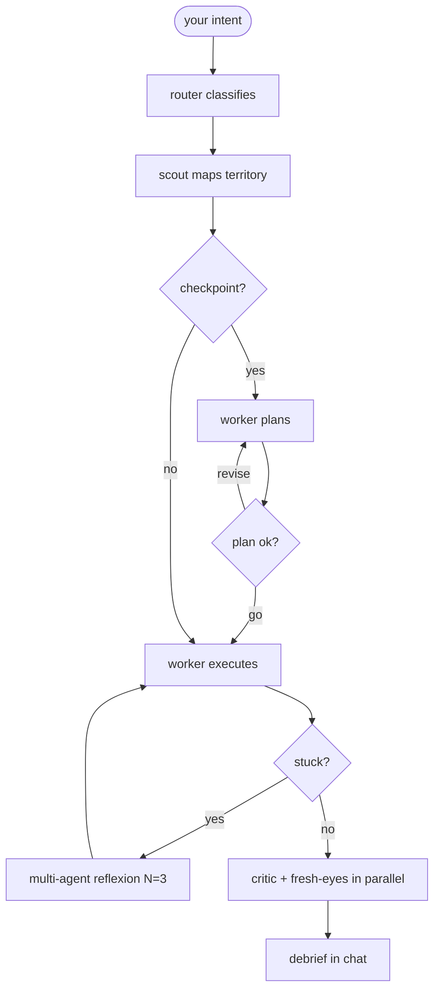

<p align="center">
  <b>crew</b> — autonomous AI dev that owns the outcome.<br/>
  <i>Five Opus agents. One persona that knows when to change gears.</i>
</p>

<p align="center">
  
  
  
  
</p>

<p align="center">
  <a href="../../README.md">← back to the Guild marketplace</a>
</p>

---

## What it is

A Claude Code plugin that takes a free-form intent and runs it to completion. Five Opus agents — **router, scout, worker, critic, fresh-eyes** — collaborate to investigate, plan, execute, and verify the result. Worker SSHes into hosts, runs `terraform`, edits code, kicks deploys, debugs airgap bundles. Critic and fresh-eyes verify the work with mandatory **evidence ledgers** of commands they actually ran.

You throw a problem at it. It owns the outcome.

---

## Mental model



- **Router** classifies the intent: mode (`investigating` / `planning` / `executing`), scope (`light` / `deep` / `paranoid`), side effects (`none` / `local` / `remote` / `production`), checkpoint required (yes/no).
- **Scout** spends a bounded budget mapping the problem — 25 tool calls / 5 minutes (doubled in `--paranoid`).
- **Worker** is one persona that **self-switches modes** as it works: investigating → planning → executing → verifying. Not five different agents — one agent that knows when to change gears.
- **Critic + fresh-eyes verify in parallel.** Critic reads the brief, plan, and journal. **Fresh-eyes reads ONLY** the intent and the current state of the code. Its job is to catch what the worker convinced itself of.
- **Multi-agent reflexion** fires when worker declares `stuck`: 3 worker variants in parallel with different framings (configuration vs environment vs permissions), a judge picks the most productive framing, worker resumes with that synthesis.

---

## Slash commands

| Command | What it does |
|---|---|
| `/crew:do "<intent>"` | Run the full flow on a free-form intent |
| `/crew:do "<intent>" --paranoid` | Double budgets, pre-arm multi-agent reflexion |
| `/crew:do "<intent>" --yolo` | Skip plan checkpoint (overridden against production) |
| `/crew:do "<intent>" --scope=light\|deep` | Override automatic scope classification |
| `/crew:resume` | Resume an interrupted run from `.crew/runs/<id>/` |
| `/crew:list` | List recent runs |
| `/crew:cancel` | Cancel an in-flight run |
| `/crew:help` | Plugin help |

---

## Checkpoints — when crew asks before doing

Crew asks for plan approval **once** if any of these are true:

- Initial mode is `planning` (the work needs design)
- Side effects are `remote` (SSH, kubectl, terraform) or `production`
- You did not pass `--yolo`

For pure investigation (`side_effects: none`), it runs end-to-end with no checkpoint. **Production beats yolo always** — `--yolo` is silently overridden when production is in scope.

---

## Real dev examples

### Investigate without touching anything

```
/crew:do figure out why our CI on main has been 40% slower this past week
```

What happens: router → mode=investigating, side_effects=none, checkpoint=false. Scout reads recent CI runs and workflow files. Worker investigates — `git log`, compares old vs recent CI timings, identifies a newly added test suite that's not parallelized. Critic verifies with an evidence ledger (`gh run list ...`, `cat .github/workflows/ci.yml`). Fresh-eyes independently re-derives the same conclusion. Debrief in chat — 4 minutes wall clock.

### Audit for security issues

```
/crew:do audit the auth middleware for places session tokens get logged, leaked into URLs, or stored insecurely
```

What happens: investigating mode. Worker greps for token-handling code, traces where tokens flow through logging, cookies, URL params. Critic re-runs the same greps to verify each finding. Output: ranked list of findings with `file:line` citations and severity.

### Set up infra (with checkpoint)

```
/crew:do provision a staging postgres instance on the existing GKE cluster and wire it into the api deployment
```

What happens: router → mode=planning, side_effects=remote, checkpoint=true. Scout maps the existing terraform + helm. Worker writes a plan, renders it in chat:

> Add `staging-postgres` to terraform, add the Secret, update the api deployment env, run migrations.

You reply **go**. Worker executes. Critic verifies kubectl resources exist; fresh-eyes verifies the api can actually connect.

### Hunt a memory leak with reflexion pre-armed

```
/crew:do --paranoid figure out what's leaking memory in the api worker — it OOMs after ~4 hours
```

What happens: scope=paranoid doubles scout budget AND pre-arms multi-agent reflexion. If worker gets stuck after initial investigation, 3 variants spawn in parallel: one frames it as a connection-pool leak, one as a JS closure leak, one as a native-buffer leak. Judge picks the framing that produced the most concrete evidence; worker resumes.

### Mechanical execution against production

```
/crew:do rotate the database password — generate a new one, update the GCP secret, restart api deployments, verify connections
```

What happens: router → mode=executing, side_effects=production. Production forces checkpoint regardless of flags. Worker shows you the rotation plan; you ack; worker rotates; critic verifies the new pods picked up the new credential; fresh-eyes verifies the old credential is invalidated.

### Compose with other plugins

```
/crew:do find all flaky tests in tests/e2e/ and root-cause each one
```

Worker has Bash + Read, so it invokes `/e2e:audit` itself, parses the `trace.zip` files, classifies failures, returns a grouped report. The critic + fresh-eyes verification still applies — every finding requires an evidence ledger.

### Resume an interrupted run

```
/crew:resume
```

Picks the most recent run from `.crew/runs/` and continues from its last phase. State is in `state.json` per run.

---

## Configuration

### `.crew/hosts.yml` (optional)

Tag your hosts so the router can detect production scope:

```yaml
prod-api: gke://prod-cluster/api
staging-api: gke://staging-cluster/api
db-prod: postgres://prod-db.example.com:5432
```

Any host name containing `prod` triggers production scope automatically.

### Run artifacts

Each run writes to `.crew/runs/<run-id>/`:

```
.crew/runs/crew-20260518-141522-a3f4/
├── state.json              # status, phase, timestamps — drives /crew:resume
├── router-config.json
├── brief.md                # scout's territory map
├── plan.md                 # worker's plan (if checkpoint)
├── journal.md              # worker's progress notes
├── reflections.md          # worker's mode-switch reasoning
├── verification.md         # worker's self-check
├── critic-verdict.md       # critic's evidence ledger
├── fresh-eyes-verdict.md   # fresh-eyes' independent ledger
├── followups.md
└── reflexion/              # only if MAR fired
    ├── variant-A/
    ├── variant-B/
    ├── variant-C/
    └── synthesis.md
```

---

## Why this exists

`--yolo` agents that don't verify get you 60% of the way before silently breaking the last 40%. Crew refuses to ship without a real evidence ledger from two independent verifiers.

The fresh-eyes agent specifically MUST NOT read the worker's notes — it re-evaluates from intent + reality alone, which catches the "the worker convinced itself it worked" failure mode that single-pass agents miss.

Production beats yolo. Always.

---

## When you don't want this

- Single-file edits — overkill. Just ask Claude directly.
- Interactive design discussions — crew is for outcomes, not brainstorming.
- Tasks where you actively want to watch every step — crew runs end-to-end and reports.

This plugin is for "go and figure it out / build it / fix it — come back when you're done."
