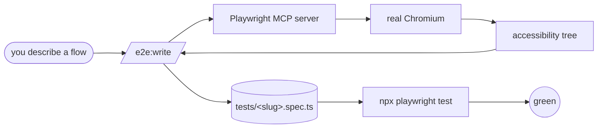

<p align="center">
  <b>e2e</b> — Playwright end-to-end test authoring and maintenance for Claude Code.<br/>
  <i>You describe the flow. Claude drives the browser. The test writes itself.</i>
</p>

<p align="center">
  
  
</p>

---

## What it is

A Claude Code plugin that lets you author and maintain Playwright end-to-end tests by describing flows in plain English. Claude opens a real browser via the Playwright MCP server, reads the accessibility tree, performs the clicks itself, and writes a passing `*.spec.ts` file. Then keeps it passing.

The trick is the **accessibility tree**: every `browser_snapshot` returns the same role+name structure Playwright will use at runtime. What Claude sees ≡ what the test will see, so selectors don't drift between authoring and execution.

---

## Why this exists

E2E tests are valuable. Writing them is tedious — you click around the app yourself, hand-write selectors, debug locators that didn't match, then maintain them when buttons get renamed. Most teams under-invest in coverage because the work is annoying.

This plugin replaces the annoying part. Tell Claude a flow; get a passing spec.

---

## How it works



For each flow:

1. `browser_navigate` to the start URL.
2. `browser_snapshot` returns the accessibility tree (roles + accessible names + structure).
3. Claude picks the right element by role+name and calls the matching MCP tool (`browser_click`, `browser_type`, `browser_select`, etc.).
4. Snapshot again, confirm the DOM changed, capture the post-state for assertions.
5. Emit `tests/<slug>.spec.ts`, run it, retry up to 3 times if selectors miss.

Non-trivial flows delegate to the `e2e:spec-writer` subagent so MCP snapshot noise stays out of the main context.

---

## Slash commands

| Command | When to run | What it does |
|---|---|---|
| `/e2e:init` | Once per project | Installs Playwright, scaffolds `playwright.config.ts` + `tests/`, registers the Playwright MCP server |
| `/e2e:write "<flow>"` | Each new feature/flow | Drives the browser, emits a green `.spec.ts` |
| `/e2e:record` | Rare (OAuth, 2FA, payments) | Wraps `playwright codegen` for manual capture |
| `/e2e:crawl` | Once at start | Discovers every route and emits a smoke spec per route |
| `/e2e:matrix` | When you have role-based access | Generates routes × roles coverage with reused storageState |
| `/e2e:audit` | After changes / pre-merge | Runs the suite, reads `trace.zip` per failure, classifies root causes |
| `/e2e:help` | Anytime | Plugin help |

---

## Quickstart

```bash
# 1. One-time setup
/e2e:init
# Restart Claude Code so the Playwright MCP server's tools load.
# Start your dev server (npm run dev, etc.) before the next step.

# 2. Author your first test
/e2e:write user signs up with email, verifies the magic link, lands on the dashboard

# 3. Build bulk coverage
/e2e:crawl

# 4. Maintain
/e2e:audit
```

---

## Real dev examples

### Writing a single flow

```
/e2e:write user adds a payment method, sees the card listed on the billing page
```

What happens: Claude navigates to `/billing`, clicks "Add payment method", fills the Stripe iframe with test card `4242 4242 4242 4242`, clicks Save, asserts the card appears in the list. Saves `tests/add-payment-card-listed-on-billing.spec.ts`. Runs `npx playwright test` to prove it green.

### Cross-page workflow with two sessions

```
/e2e:write admin invites a teammate by email, teammate accepts via the invite link, lands on the org's dashboard with viewer role
```

What happens: Claude drives both sessions (admin + teammate) via separate browser contexts, then asserts the role badge on the teammate's dashboard. Saved as `tests/invite-teammate-viewer-role.spec.ts`.

### Bulk smoke coverage at project start

```
/e2e:crawl
```

What happens: discovers `/`, `/login`, `/signup`, `/dashboard`, `/billing`, `/settings/*` from your router, generates `tests/smoke-<route>.spec.ts` per route — each does a navigation, waits for the page to be interactive, asserts no console errors.

### Role matrix for an admin panel

```
/e2e:matrix routes=/admin/* roles=admin,staff,guest
```

What happens: logs in once per role, caches sessions to `.auth/admin.json` etc., generates a spec per (route, role) pair asserting expected access (200, 403, or redirect to login).

### Triage after a refactor

```
/e2e:audit
```

Example output:

```
Audit: 42 tests run, 38 passed, 4 failed in 23.4s

Failures by class:
  SELECTOR_DRIFT: 3
  CONSOLE_ERROR: 1

Findings:
  [SELECTOR_DRIFT] tests/login.spec.ts:14 — "Sign in" button renamed to "Log in"
    Fix: update locator to getByRole('button', { name: /sign|log in/i })
  [CONSOLE_ERROR] tests/dashboard.spec.ts:22 — TypeError: Cannot read properties of undefined (reading 'tier')
    Fix: real product bug — user.tier is undefined on free plan
```

Add `--fix` for proposed patches — it stops and asks before applying.

### Manual capture for flows Claude shouldn't do itself

```
/e2e:record
```

Wraps `playwright codegen`. You click through real OAuth, 2FA, or payments yourself; Playwright records into a `.spec.ts`. Use this when giving Claude live credentials would be a bad idea.

---

## What the plugin enforces

- **Selectors:** `getByRole`, `getByLabel`, `getByText`. CSS selectors and XPath require an inline comment justifying the exception.
- **Waits:** no `page.waitForTimeout(ms)`. Auto-wait via `await expect(locator).toBeVisible()` or `.toHaveText()`.
- **Idempotency:** each `test()` is self-contained. No "this test depends on the previous one."
- **Trace-driven debugging:** when a test fails twice, the trace at `test-results/<test>/trace.zip` is the source of truth, not stack traces.

These rules live in `skills/author/SKILL.md` (authoring) and `skills/diagnose/SKILL.md` (triage). Both skills auto-load with the relevant commands.

---

## Files written to disk

```
your-project/
├── playwright.config.ts          # from /e2e:init
├── .mcp.json                     # contains the Playwright MCP entry
├── tests/
│   ├── signup-*.spec.ts          # from /e2e:write
│   ├── smoke-*.spec.ts           # from /e2e:crawl
│   └── matrix-*.spec.ts          # from /e2e:matrix
├── test-results/                 # Playwright run artifacts (gitignored)
├── playwright-report/            # HTML report (gitignored)
└── .auth/                        # cached storageState per role (gitignored)
```

---

## Prereqs

- Node.js 18+
- A reachable dev server at the `baseURL` in `playwright.config.ts` (default `http://localhost:3000`)
- After `/e2e:init`, **restart Claude Code** so the Playwright MCP server's tools load. Without restart, `/e2e:write` has nothing to drive.

---

## When you don't want this

- Unit tests — Playwright is too heavy. Use Vitest/Jest/etc.
- API contract tests — use a contract testing tool; this plugin tests UI behavior.
- Performance/load — Playwright isn't a load generator.

This plugin is specifically for the "did the user-facing flow work" question.
