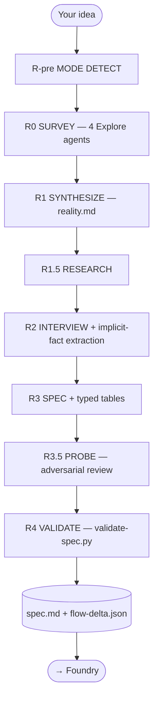

<p align="center">
  <b>forge</b> — the codebase-aware specification engine for Claude Code.<br/>
  <i>Forge plans. Foundry builds.</i>
</p>

<p align="center">
  
  
  
  
</p>

<p align="center">
  <a href="../../README.md">← back to the Guild marketplace</a>
</p>

---

## What it is

Forge is a Claude Code plugin that runs a structured **specification interview** against your existing codebase and produces a `spec.md` (and `flow-delta.json` on brownfield runs) that Foundry can execute autonomously. It does not write code. It does not propose features. Its single job is to capture what you actually want, ground it in what already exists, and lock it into a citation-backed artifact that survives the trip to the build engine.

The artifact is the deliverable. Every mechanism in Forge exists to keep that artifact intact.

---

## Mental model



Brownfield runs add a `flow-mapper` agent before R2 so the interviewer walks you through hop-by-hop confirmation against an LSP-anchored graph. Greenfield runs skip flow mapping entirely. Cosmetic runs skip even research, going straight from R-pre to R3.

---

## Phases

| Phase | What it does | Outputs |
|---|---|---|
| **R-pre MODE DETECT** | Classifies the run as `brownfield` / `greenfield` / `cosmetic` and confirms with you | `state.md` mode field |
| **R0 SURVEY** | 4 Explore agents map architecture, data, surface, and infra in parallel | `survey/architecture.md`, `survey/data.md`, `survey/surface.md`, `survey/infra.md` |
| **R1 SYNTHESIZE** | Merges survey outputs into one grounded reality document | `survey/reality.md` |
| **R1.5 RESEARCH** | Targeted online research for library versions, API shapes, common gotchas | inline citations in subsequent stages |
| **R2 INTERVIEW** | Adaptive `AskUserQuestion` interview; brownfield mode adds flow-graph + node-by-node hop confirmation; **INTV-01** captures implicit environmental facts as `A-AUTO-NNN` entries | `transcript.md` (every answer tagged `A-NNN` with `[IMPLICIT_FACT:*]` markers) |
| **R3 SPEC** | Writes `spec.md` with typed `## Global Invariants` / `## State Transitions` / `## Contracts` tables (**TYPE-01**); brownfield runs additionally write `flow-delta.json` | `spec.md`, optional `flow-delta.json` |
| **R3.5 PROBE** | Adversarial reviewer (**PROBE-01**) reads the draft spec as a Foundry teammate would; flags ambiguities, missing citations, contradictory `[from A-NNN]` chains | `PROBE-NNN` findings appended to spec, resolved before SPEC FORGED |
| **R4 VALIDATE** | `validate-spec.py` mechanically checks file references, citations, coverage, verbatim Locked-fidelity, and `spec_format_version` frontmatter (**TYPE-02**) | non-zero exit on any failure |

---

## What you'll write to disk

```
forge-specs/
└── {feature-slug}/
    ├── spec.md            # The locked spec
    ├── transcript.md      # Every answer, tagged A-NNN
    ├── state.md           # Mode + spec_type + cohort metadata
    ├── flow-delta.json    # brownfield runs only — packet-derived hops
    └── survey/
        ├── reality.md
        ├── architecture.md
        ├── data.md
        ├── surface.md
        └── infra.md
```

The `spec.md` carries:

- **Frontmatter** — `spec_format_version: v2.1` (TYPE-02); legacy `v2.0` is forward-compatible.
- **Three typed tables** (TYPE-01) — `## Global Invariants`, `## State Transitions`, `## Contracts`. Every row carries a `[from A-NNN]` citation. Foundry F0.5 propagates each table byte-identical into every casting prompt; PROBE / TEST / INTENT verifications all key off these tables.
- **Tagged requirements** — `A-NNN` (transcript), `US-NNN` (user story), `FR-NNN` (functional req), `NFR-NNN` (non-functional), `AC-NNN` (acceptance), `GI-NNN` (global invariant), `ST-NNN` (state transition), `CT-NNN` (contract).
- **Requirement classification** — every item tagged `Locked` (implement exactly, verbatim transcript citation required), `Flexible` (teammate discretion), or `Informational` (context only).
- **Verbatim transcript appendix** — the source of truth Locked items must quote.

---

## Slash commands

| Command | What it does |
|---|---|
| `/forge:plan "<feature description>"` | Run the full interview; produces `spec.md` |
| `/forge:resume` | Pick up an interrupted interview from `state.md` |
| `/forge:cleanup` | Remove all interview state files for a run |
| `/forge:help` | Show plugin help |

---

## Agents

| Agent | Used in | Notes |
|---|---|---|
| `flow-interviewer.md` | R2 (brownfield) | Walks the user node-by-node through the LSP-anchored graph |
| `researcher.md` | R1.5 | Targeted ecosystem research per identified domain |
| `spec-reviewer.md` | R3.5 (PROBE-01) | Adversarial review of the draft spec; emits `spec-review.json` with a binary block/pass verdict |

Forge's own interview thread — R1 SYNTHESIZE, R1.75, R2 INTERVIEW, R3 SPEC and R4 VALIDATE — and its four R0 Explore surveyors all run on your **session model**, so `/model` already steers them. The agents above are the only ones carrying a pin of their own.

---

## Model selection

Forge declares one `userConfig` option, `model`, in `.claude-plugin/plugin.json`. It moves a curated subset of agents onto a different model without editing a single frontmatter pin.

| Property | Value |
|---|---|
| Option key | `model` |
| Accepted values | `opus`, `sonnet`, `haiku`, `fable`, `inherit` |
| Any other value | Refused, with a message naming the accepted set |
| Unset | No model parameter is emitted at any spawn. Every agent's frontmatter pin governs and behaviour is identical to today |

Set it per plugin, for one session:

```bash
claude --config model=fable
```

`pluginConfigs` is read from user settings, `--settings`, and managed settings only — project and local settings are ignored for it.

**The option is declared per plugin.** Forge and Foundry each declare their own identically-named `model` option, and there is no shared cross-plugin store. Set it once under `forge@guild` and once under `foundry@guild` if you want both steered.

### What the option reaches

| Agent | Baseline pin | Steerable by `model`? |
|---|---|---|
| `forge:spec-reviewer` | opus, `effort: high` (was sonnet) | Yes |
| `foundry:teammate` | opus, `effort: xhigh` | Yes |
| `foundry:flow-mapper` | opus, `effort: high` (was sonnet) | Yes |
| `foundry:assayer` | opus, `effort: max` | No — fixed baseline |
| `foundry:intent-carrier` | opus, `effort: max` | No — fixed baseline |
| `foundry:test-observations-adjudicator` | opus, `effort: max` | No — fixed baseline |
| `foundry:pattern-mapper` | opus (was sonnet) | No — fixed baseline |
| `foundry:spec-test-deriver` | opus, `effort: high` (was sonnet) | No — fixed baseline |

`forge:spec-reviewer` is the only forge agent the option reaches. Every other agent keeps the model it ships with and is not reachable at any setting: `forge:researcher` stays sonnet, foundry's `tracer`, `flow-tracer`, `nyquist-auditor` and `researcher` stay sonnet, and foundry's four haiku agents stay haiku. **No agent in any plugin other than forge and foundry changes model at any setting of this option.**

### How the value is delivered

Frontmatter pins are always literal. An agent declaring `model: ${user_config.model}` fails at spawn time — the placeholder reaches the model resolver unsubstituted — so the option can never rewrite a pin. Each pin is the floor, and the configured value is applied at spawn time on top of it.

Forge ships no MCP server, so the value travels through command content instead: `/forge:plan`'s R3.5 step carries a `${user_config.model}` token that the harness substitutes before the Lead reads it, and the Lead passes the substituted value as the spawn `model` parameter for `forge:spec-reviewer` and for no other agent. **An empty substitution yields no parameter at all** — an unset option substitutes as an empty string rather than as an absent token, so the emptiness check is what makes "unset" indistinguishable from "never implemented". Foundry's half of the pilot uses a different path: its MCP server receives the value as an environment variable and owns the policy centrally.

### If you cannot reach the configured model

A blocked model does not fail the spawn. Claude Code checks the value against your organisation's `availableModels` allowlist; for a blocked family alias it runs the subagent on the newest permitted version of that family, and for any other blocked value — or when the allowlist permits no version of the family at all — it runs the subagent on the **inherited model** instead, warning in interactive sessions and naming both models.

`fable` in particular is a Covered Model with mandatory 30-day retention and is **not available under Zero Data Retention**, so ZDR-bound consumers get the inherited model rather than a failed run. Forge stays fully usable without `fable`.

---

## Scripts

| Script | What it does |
|---|---|
| `scripts/setup-forge.sh` | One-shot setup hook for the slash commands |
| `scripts/validate-spec.py` | Deterministic R4 gate; verifies citations, coverage, verbatim Locked-fidelity, frontmatter version. Exits non-zero on any failure |

---

## Tests

```bash
cd plugins/forge && uvx pytest
```

Current baseline: **50 passed + 1 skipped** (synthetic-fixture suite). The skipped test is the `RUN-01` real-run gate — empirical proof from a live cross-cohort matrix, deferred to a future milestone.

---

## What's new since v4.2.0

Forge ships four additions over the v4.2.0 base:

- **INTV-01** — implicit-fact extraction at R2
- **TYPE-01** — typed Global Invariants / State Transitions / Contracts tables at R3
- **TYPE-02** — `spec_format_version` frontmatter at R4 (legacy `v2.0` builds unchanged)
- **PROBE-01** — adversarial spec review at R3.5

Each is verified by the synthetic-fixture suite. Empirical proof from a live cross-cohort matrix is tracked separately and ships in a future milestone.

---

## Why Forge does not build

The split is load-bearing. An interviewer that also writes code is biased toward asking questions whose answers it knows how to implement. An interviewer that hands the spec to a different process across a frozen boundary asks questions about *the user's actual problem*. Forge is engineered to be a worse builder than it is an interviewer — by construction, it cannot do the build, so it doesn't try.

What Forge writes is what Foundry reads, byte for byte. Every `[from A-NNN]` citation, every `Locked:` quote, every typed-table row survives the trip.

Forge plans. Foundry builds.
