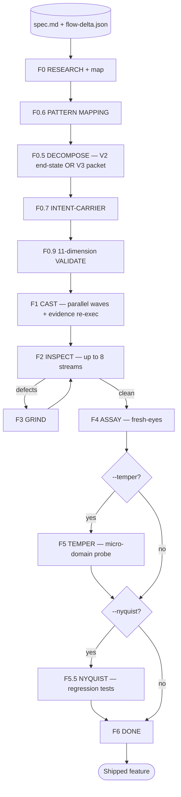

<p align="center">
  <b>foundry</b> — the autonomous build-verify-fix loop for Claude Code.<br/>
  <i>Forge plans. Foundry builds.</i>
</p>

<p align="center">
  
  
  
  
</p>

<p align="center">
  <a href="../../README.md">← back to the Guild marketplace</a>
</p>

---

## What it is

Foundry is a Claude Code plugin that takes a Forge-produced spec and runs an **autonomous build-verify-fix loop** until the feature is shipped or an error stops the run. There are no approval gates. No "is this what you wanted?" checkpoints. The Lead inside Claude Code reads the spec, decomposes it into castings, dispatches teammate prompts verbatim, runs up to eight parallel verification streams, grinds defects to zero, then assays the result with fresh eyes against the original spec.

The discipline is the product. Every mechanism in Foundry exists to keep the spec intact across the build.

---

## Mental model



---

## Phases

| Phase | What it does | Key tools |
|---|---|---|
| **F0 RESEARCH** | Per-domain `researcher` agents (sonnet, parallel); optional `codebase-mapper` extracts `MANDATORY_RULES.md` | `Foundry-Init` |
| **F0.6 PATTERN** | `pattern-mapper` finds analog files for every spec target; emits `PATTERNS.md` with `<analog_pattern>` and `<shared_patterns>` excerpts | — |
| **F0.5 DECOMPOSE** | Authors casting manifest + per-casting prompt files; **V2 end-state mode** for `flow-delta.json`-less specs, **V3 packet mode** for brownfield flow-delta runs | `Foundry-Spawn-Teammate` (background) |
| **F0.7 INTENT-CARRIER** | Verifies every transcript `A-NNN` answer survives into a casting prompt; `INTENT_DROPPED` blocks F0.9 (skipped on `< v2.1` specs) | `Foundry-Intent-Coverage` |
| **F0.9 VALIDATE** | 11-dimension mechanical gate; sub-checks 7e/7g/7h/7i/7j/7m verify byte-identical block propagation | `Foundry-Validate-Castings` |
| **F1 CAST** | Parallel wave-based building; `Foundry-Accept-Casting` re-runs cited evidence server-side and binds it to specific requirement IDs | `Foundry-Cast-Wave`, `Foundry-Accept-Casting` |
| **F2 INSPECT** | Up to 8 parallel verification streams (see below) | `Foundry-Sync` |
| **F3 GRIND** | Defects → casting-scoped tasks → fix → re-inspect | `Foundry-Tasks`, `Foundry-Fix` |
| **F4 ASSAY** | Four parallel `assayer` agents (opus); spec-before-code methodology | `Foundry-Verdict` |
| **F5 TEMPER** | Optional (`--temper`) — micro-domain stress testing | `Foundry-Stream` |
| **F5.5 NYQUIST** | Optional (`--nyquist`) — regression test generation for VERIFIED requirements | `Foundry-Stream` |
| **F6 DONE** | Shutdown all teammates, generate report, mark `done` | `Foundry-Phase("done")` |

---

## F2 INSPECT streams

| Stream | What it verifies | When it runs |
|---|---|---|
| **TRACE** | Upstream wiring: EXISTS → SUBSTANTIVE → WIRED → PLACED (LSP-powered, sonnet) | Always |
| **FLOW_TRACE** | Downstream wiring: PRODUCED → CONSUMES_UPSTREAM → SUBSTANTIVE → CHAIN_INTACT | Brownfield (`flow-delta.json` present) |
| **PROVE** | Spec-to-code citation verification with stub detection (opus) | Always |
| **RESEARCH_AUDIT** | Code honours every research recommendation from F0 | When research findings exist or Informational items appear in spec |
| **COVERAGE_DIFF** | 1:1 source → destination symbol check | MIGRATION specs only |
| **SIGHT** | Browser-based UI audit via Playwright (lead runs directly) | When the spec describes UI behavior |
| **TEST / PROBE** | Full test suite + API smoke (inline) | Always |
| **TEST_OBSERVATIONS (TEST-01)** | Spec-only test derivation: reads `## Contracts` table, generates Hypothesis property tests, runs them code-blind, emits `test_observations` report | When spec is `>= v2.1` and `## Contracts` table is non-empty |

Zero defects → F4. Any defect → F3 → F2 → F4 (full re-verify after every fix).

---

## What every casting prompt carries

The drift-prevention sextet — six frozen, byte-identical-across-the-run blocks every teammate sees:

```markdown
<mandatory_rules>           # CLAUDE.md / AGENTS.md / .cursorrules verbatim
<global_invariants>         # cross-cutting spec rules (from spec ## Global Invariants section)
<invariants>                # spec ## Global Invariants table — TYPE-01
<state_transitions>         # spec ## State Transitions table — TYPE-01
<contracts>                 # spec ## Contracts table — TYPE-01
<spec_requirements>         # this casting's spec slice (V2 only)
<analog_pattern>            # F0.6 pattern excerpts (Imports/Setup/Core/Error)
<shared_patterns>           # F0.6 cross-cutting patterns (auth, error, logging)
```

In V3 packet mode, `<spec_requirements>` is replaced by structural blocks: `<upstream_anchor>`, `<prerequisite_hops>`, `<this_hop>`, `<downstream_contract>`, `<self_check>`. The teammate has **no end-state framing** in attention — only the hop contract. This is V3's reversal of the failure mode where backward-fabrication causes endpoint-anchored plumbing hallucination.

---

## Slash commands

| Command | What it does |
|---|---|
| `/foundry:setup` | Install MCP server + verify Python prerequisites |
| `/foundry:start "<scope>" --spec PATH` | Start a build-verify-fix loop |
| `/foundry:status` | Show current foundry run status |
| `/foundry:resume` | Resume an interrupted run |
| `/foundry:stop` | Gracefully stop the current run |
| `/foundry:help` | Show plugin help |

`/foundry:start` flags:

| Flag | Effect |
|---|---|
| `--spec PATH` | Spec file (required) |
| `--url URL` | Run against a URL surface (alternative to filesystem-only) |
| `--temper` | Enable F5 TEMPER stress testing |
| `--nyquist` | Enable F5.5 NYQUIST regression test generation |
| `--max-cycles N` | Cap GRIND cycle count |
| `--no-ui` | Suppress orchestrator banners |
| `--output-dir DIR` | Override `foundry-archive/` location |

---

## Skills

The `skills/` directory carries the Lead's verification-stream methodology references:

- `skills/prove/` — spec-before-code citation verification methodology
- `skills/sight/` — Playwright-based UI audit methodology
- `skills/temper/` — micro-domain stress-testing methodology
- `skills/trace/` — LSP-anchored upstream wiring methodology

Foundry-Sight runs these as Claude Code skills directly during the corresponding INSPECT streams.

---

## Agents

| Agent | Phase | Model | Notes |
|---|---|---|---|
| `researcher.md` | F0 | sonnet | Per-domain research; parallel up to 4 |
| `research-synthesizer.md` | F0 | sonnet | Merges 4+ research outputs into `SUMMARY.md` |
| `codebase-mapper.md` | F0 (optional) | sonnet | Extracts MANDATORY_RULES + STACK + ARCHITECTURE + STRUCTURE + CONVENTIONS + INTEGRATIONS + CONCERNS |
| `flow-mapper.md` | F0 (V3 brownfield) | — | Grounded `flow-graph.json` from LSP/grep |
| `tracer.md` | F2 TRACE | sonnet | Three-level EXISTS → SUBSTANTIVE → WIRED |
| `flow-tracer.md` | F2 FLOW_TRACE | sonnet | Mirror of tracer for downstream verification |
| `assayer.md` | F2 PROVE / F4 ASSAY | opus | Spec-before-code + stub detection |
| `research-auditor.md` | F2 RESEARCH_AUDIT | sonnet | Verifies code honours research |
| `coverage-diff.md` | F2 COVERAGE_DIFF | sonnet | 1:1 MIGRATION check |
| `nyquist-auditor.md` | F5.5 | sonnet | Regression test generation |
| `teammate.md` | F1 CAST / F3 GRIND | opus | Methodical implementation; CAST deliberates, GRIND stays surgical |

The Lead never authors teammate prompts — F0.5 DECOMPOSE wrote them once, F1/F3 dispatch them verbatim. The Lead is a router, not an interpreter.

---

## MCP server

The `mcp-server/` directory ships a Python MCP server (`foundry-mcp`) that backs every Lead-side tool call. Without it the slash command loads but the workflow cannot drive — `Foundry-Init`, `Foundry-Next`, `Foundry-Validate-Castings` etc. are all served from there.

Wire it into your project once:

```bash
claude mcp add foundry -- uvx --from "git+https://github.com/alphabravo-oss/guild#subdirectory=plugins/foundry/mcp-server" foundry-mcp --project-root .
```

The server stores all run state under `foundry-archive/{run}/` in your project — castings, prompts, defects, handoffs, reports, every acceptance check. A full audit trail per build.

| Tool | When |
|---|---|
| `Foundry-Init` | F0: create the run |
| `Foundry-Next` | Every step: returns `YOUR NEXT CALL:` imperative |
| `Foundry-Gate` | Before phase transitions |
| `Foundry-Phase` | Mark phase transitions |
| `Foundry-Spawn-Teammate` | F0.5 / F1 / F3: read pre-authored teammate prompt |
| `Foundry-Cast-Wave` | F1: bulk-fetch every casting prompt for a wave |
| `Foundry-Validate-Castings` | F0.9: 11-dimension validate |
| `Foundry-Intent-Coverage` | F0.7: A-NNN coverage check |
| `Foundry-Spec-Hash` | Before acceptance: fresh hash forces spec re-read |
| `Foundry-Accept-Casting` | F1: re-run cited evidence + bind to requirement IDs |
| `Foundry-Handoff` | Record every phase / artifact transition |
| `Foundry-Defect` / `Foundry-Sync` / `Foundry-Tasks` / `Foundry-Fix` | F2 / F3 defect lifecycle |
| `Foundry-Verdict` | F4 ASSAY verdicts |
| `Foundry-Coverage` | Traceability matrix |
| `Foundry-Stream` | Mark verification stream complete |
| `Foundry-Context` | Reload state after compaction |
| `Foundry-Team-Up` / `Foundry-Team-Down` | Teammate lifecycle around CAST + GRIND waves |

---

## Tests

```bash
cd plugins/foundry/mcp-server && uv run --with pytest pytest
```

`uv run` is required, not `uvx pytest` — the suite imports `foundry_mcp.server`, which imports `mcp`, so it needs the project's declared dependencies on the path. `uvx` builds an isolated pytest environment without them and two tests fail on `ModuleNotFoundError`.

Current baseline: **113 passed + 1 skipped** (synthetic-fixture suite covering every MCP tool's parsers, schemas, and handoff state). The skipped test is the `measure-run` planning-cohort gate, which needs real-run stubs not carried in this checkout. The empirical cross-cohort matrix (`measure-run.py`) ships as a separate consolidation tooling under `plugins/foundry/scripts/measure-run.py` (397 LOC, stdlib-only) for future milestone-level RUN-01 closure.

---

## Model allocation

| Role | Model |
|---|---|
| Lead | opus |
| F0 researchers | sonnet |
| F0.5 decompose | opus |
| F0.6 pattern-mapper | sonnet |
| F1 CAST teammates | opus |
| F2 TRACE / FLOW_TRACE | sonnet |
| F2 PROVE | opus |
| F3 GRIND teammates | opus |
| F4 ASSAY | opus |
| F5 TEMPER | sonnet |
| F5.5 NYQUIST | sonnet |

---

## What's new since v4.2.0

Foundry ships four additions over the v4.2.0 base:

- **EVID-01** — `Foundry-Accept-Casting` re-runs cited evidence commands server-side
- **EVID-02** — completion-report evidence binds to specific requirement IDs
- **TEST-01** — 8th INSPECT stream: spec-only Hypothesis test derivation
- **INTENT-01** — F0.7 intent-carrier between F0.5 and F0.9; A-NNN coverage check

F0.9 grew from 9 dimensions to 11 (added File-Change-Map ↔ key_files cross-check + Pattern Compliance) and gained six new propagation sub-checks (7e / 7g / 7h / 7i / 7j / 7m).

Each is verified by the synthetic-fixture suite. Empirical proof from a live cross-cohort matrix is tracked separately and ships in a future milestone.

---

## Why Foundry does not interview

The split is load-bearing. A builder that also interviews is biased toward designing castings whose shape it knows how to ship. A builder that consumes a frozen spec produced elsewhere just *implements what the spec says*. Foundry is engineered to be a worse interviewer than it is a builder — by construction, it cannot ask questions, so it doesn't try.

What Forge writes is what Foundry reads, byte for byte. Every `[from A-NNN]` citation, every `Locked:` quote, every typed-table row, every implicit-fact tag survives the trip.

Forge plans. Foundry builds.
