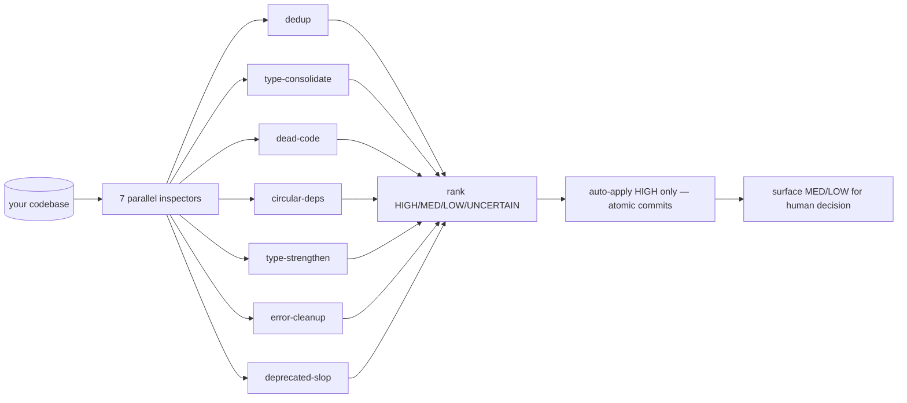

<p align="center">
  <b>tidy</b> — careful, low-risk codebase cleanup across 7 focused tracks.<br/>
  <i>HIGH-confidence only. Atomic commits. Refuses dirty trees.</i>
</p>

<p align="center">
  
  
</p>

---

## What it is

A Claude Code plugin that runs 7 focused cleanup tracks in parallel. Each track inspects read-only, writes a critical assessment, ranks proposed changes by confidence, and auto-applies **only the HIGH-confidence LOW-risk** subset. Runs type checks, tests, and lints after every batch, with atomic git commits so any regression is one `git revert` away.

The default is `--dry-run`. Applying changes is opt-in. `--auto` skips the apply checkpoint but **never the HIGH-only confidence gate**.

---

## The 7 tracks



| Track | Looks for | Example HIGH-confidence change |
|---|---|---|
| **dedup** | Functions/components/utilities that do the same thing | Two `formatDate(d)` implementations identical in behavior → keep one, point all callers at it |
| **type-consolidate** | Same-shape interfaces declared in N places | Three local `type User` definitions → one shared in `types/user.ts` |
| **dead-code** | Unreferenced exports, unused params, unreachable branches | A `legacyHandler` no callsite has touched since 2024 |
| **circular-deps** | Import cycles that hurt build perf + clarity | `a → b → a` resolved by extracting the shared piece to `c` |
| **type-strengthen** | `any` / `unknown` / overly-wide signatures with obvious narrower replacements | `userId: any` → `userId: string` once all callsites prove it |
| **error-cleanup** | `catch {}` that swallows, `throw new Error('TODO')` left behind | Empty catches → log + rethrow |
| **deprecated-slop** | Stale `@deprecated`, commented-out blocks, AI-pattern boilerplate | `// TODO(claude): refactor` comments that never got resolved |

Each track writes a critical assessment before any change. In `--dry-run` you read the assessment and decide.

---

## Confidence gate

Every proposed change is ranked:

- **HIGH** — verified safe by static analysis + tests. Auto-applies (in `--apply` or `--auto` mode).
- **MEDIUM** — likely safe but has at least one judgement call. Surfaces for human decision.
- **LOW** — risky or context-dependent. Surfaces with caveat.
- **UNCERTAIN** — needs domain knowledge tidy doesn't have. Surfaces only.

**`--auto` skips the apply checkpoint but never the HIGH gate.** MEDIUM and LOW always need explicit human ack.

---

## Anti-pattern guardrails

Tidy will **NOT**:

- Merge code that just **looks** similar — behavior must be byte-equivalent or AST-equivalent.
- Remove dynamically-imported / config-referenced / framework-convention / generated code — even if it has no static callsite.
- Strip legitimate boundary types — JSON parses, external APIs, FFI, deserialization stay typed as the real (untrusted) shape.
- Silence real error boundaries — empty catches are *fixed*, not removed.
- Introduce new abstractions to break a cycle — it'd rather report the cycle than refactor for its own sake.
- Use comments as the source of truth — if the comment says one thing and the code another, the code wins.
- Run on a **dirty working tree** — refuses to start unless `git status` is clean.

---

## Slash commands

| Command | What it does |
|---|---|
| `/tidy:run` | Default `--dry-run`. Runs all 7 inspectors, produces assessments, applies nothing. |
| `/tidy:run --apply` | Runs inspectors, presents HIGH-confidence changes, **stops at a checkpoint** before applying. |
| `/tidy:run --auto` | Same as `--apply` but no checkpoint — auto-applies HIGH changes batch by batch. Still gates MED/LOW. |
| `/tidy:run --tracks=dedup,dead-code` | Restrict to specific tracks (default: all 7). Accepts names or numbers (`--tracks=1,3,5`). |
| `/tidy:apply` | Apply changes from a prior `--dry-run` assessment. |
| `/tidy:status` | Show the state of the current/last tidy run. |
| `/tidy:help` | Plugin help |

---

## Real dev examples

### Dry run before a release

```
/tidy:run
```

Output:

```
Tidy: 7 tracks completed in 1m42s

Findings:
  dedup              HIGH: 3   MED: 5   LOW: 2
  type-consolidate   HIGH: 8   MED: 12  LOW: 0
  dead-code          HIGH: 14  MED: 6   LOW: 3
  circular-deps      HIGH: 0   MED: 2   LOW: 0
  type-strengthen    HIGH: 6   MED: 18  LOW: 7
  error-cleanup      HIGH: 4   MED: 3   LOW: 1
  deprecated-slop    HIGH: 11  MED: 0   LOW: 0

HIGH-confidence auto-applicable: 46 changes
Re-run with --apply to review and apply.
```

### Apply the safe wins

```
/tidy:run --apply
```

What happens: tidy presents the 46 HIGH changes batch by batch (typically 5-10 per batch by track + file group). You ack each batch. After each ack: `git add` → `npm test` → `npm run typecheck` → atomic commit. If a check fails, the batch is reverted automatically and surfaced — you don't have to babysit reverts.

### Hands-off batch run

```
/tidy:run --auto --tracks=dead-code,deprecated-slop
```

What happens: tidy runs both tracks, auto-applies HIGH changes, commits each batch atomically. Surfaces MED/LOW with no action. Good for periodic maintenance — schedule it weekly.

### Scoped cleanup before a refactor

```
/tidy:run --tracks=dedup,type-consolidate
```

What happens: only those two tracks run. Useful when you're about to refactor a subtree and want the easy wins applied first so the real refactor is smaller.

### Resume from a previous dry-run

```
/tidy:apply
```

Reads the assessments from the latest `/tidy:run --dry-run` and applies HIGH changes with the same checkpoint behavior as `--apply`.

---

## What you get

```
your-repo/
├── (your code, with HIGH-confidence cleanups applied)
└── .tidy/
    └── runs/<run-id>/
        ├── assessment-dedup.md
        ├── assessment-type-consolidate.md
        ├── ... (one per track)
        ├── decisions.md        # MED/LOW items needing human input
        └── log.md              # batch-by-batch run log
```

Each batch is an atomic git commit with a message like:

```
chore(tidy): remove 3 unused exports

- `legacyHandler` from src/api/handlers.ts (last referenced 2024-08)
- `oldFormatter` from src/util/format.ts (no static or dynamic references)
- `_internalCheck` from src/auth/session.ts (replaced by checkSession in #1248)

Verified: npm test + typecheck pass.
```

Revertable individually. No 200-file mega-commits.

---

## When to run it

- **Before a release** — cleanup of obvious cruft, surfaced MED/LOW for the next sprint
- **After a feature merge** — peel off easy wins the feature exposed
- **As periodic maintenance** — `/tidy:run --auto --tracks=dead-code,deprecated-slop` on a weekly cron
- **Before a refactor** — scope to the area you're about to touch, apply HIGH, then refactor

**Don't** run it as a "let's clean up everything before shipping" panic measure on a deadline — the MED/LOW review takes real time and shouldn't be rushed.

---

## Why this exists

Most "cleanup" passes either (a) under-apply because the human got bored, or (b) over-apply because a tool was too aggressive. Tidy splits the difference: machines are great at finding and ranking, terrible at judgment calls. So the machine finds and ranks; the human handles judgment. HIGH-only auto-apply keeps the bot honest. Atomic commits keep regressions cheap. Refusing dirty trees keeps blame clean.

---

## Prereqs

- A git repository — atomic commits are the safety mechanism, so tidy refuses to run outside one.
- A clean working tree — tidy will not run while you have uncommitted changes. Stash or branch first.
- Language tooling on `PATH` — tidy detects and uses whatever's appropriate (TypeScript: `tsc`, `eslint`; Python: `mypy`, `ruff`; Go: `go vet`, `staticcheck`; etc.).
