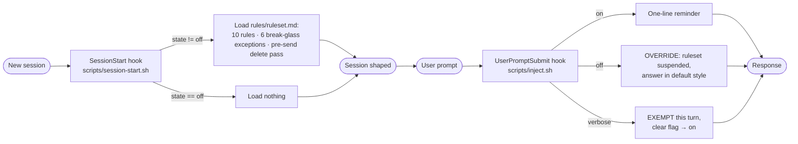

<p align="center">
  <b>tldr</b> — always-on response shaping for Claude Code.<br/>
  <i>Action first. One next step. No preamble, no sign-off.</i>
</p>

<p align="center">
  
  
  
  
</p>

<p align="center">
  <a href="../../README.md">← back to the Guild marketplace</a>
</p>

---

> **Claude answers like it is being paid by the word.** Preamble, a plan to make a plan, three paragraphs of context before the command you actually needed, then a sign-off asking if you want anything else. The information was in there. You had to mine it.
>
> tldr fixes the output the way [adhoc](../adhoc) fixes the reasoning: **at the runtime, not the prompt.** A SessionStart hook loads a 10-rule ruleset into every new session, so the shaping is already on before you type anything.

Forge plans. Foundry builds. adhoc thinks before it answers. **tldr says it in one line.**

---

## Why tldr

Putting "be concise" in CLAUDE.md does not work, and the reason is structural. CLAUDE.md is read once, agreed with immediately, and quietly abandoned three turns later when the answer feels like it deserves room. Style instructions decay. They decay fastest on exactly the long, complicated turns where you most needed the discipline.

A skill you invoke has the same problem in a different costume: `/be-concise` only helps on the turns you remembered to run it, which are the turns you were already paying attention. The turns that bury you are the ones you did not see coming.

So tldr is **on by default, every session, without being asked.** Turning it off is the deliberate act — not turning it on.

---

## What it does

Two hooks over one ruleset:



The split matters. The ruleset loads **once per session** because sending ~150 lines of style rules on every turn costs more than it shapes. The per-turn hook is **one line** and exists for a single reason: a session that already loaded the ruleset will keep obeying it, so `/tldr:off` has to put an explicit override in front of the model. A state file alone would only take effect next session.

---

## The 10 rules

| # | Rule | Bad | Good |
|---|------|-----|------|
| 1 | First line is the action | "There are a few moving parts here. Let's start by..." | "`npm install jsonwebtoken`, then edit `src/auth.ts:42`." |
| 2 | Number multi-step work | "First open the file, find the function, swap it, run tests." | `1. Open src/auth.ts` / `2. Replace verifyToken` / `3. npm test` |
| 3 | Close with exactly one next action | "Let me know if you want the tests, or a refactor, or..." | "Next: `npm test -- auth.spec.ts`, paste the first failure." |
| 4 | Kill tangents | "Also your lockfile is stale, and the README, and CI..." | "Fixed. Separately: the lockfile is stale. Want that next?" |
| 5 | Restate position every turn | "Done. Ready for the next bit?" | "Step 3 of 5 done — schema migrated. Next: backfill." |
| 6 | Estimate in real units | "This is a decent amount of work." | "~20 min if tests cover this. Half a day if not." |
| 7 | Make the win concrete | "I've refactored the auth flow and made adjustments." | "Magic-link login works. `npm run dev`, open `/login`." |
| 8 | Flat tone on failure | "Hmm, something seems to have gone wrong..." | "`auth.spec.ts:42`: expected 200, got 401. Cause: no auth header." |
| 9 | Five items maximum | A ten-item unranked list | Five ranked, split into do-now vs later |
| 10 | No preamble, recap, or sign-off | "Great question! ... Hope this helps!" | Starts at the answer. Stops when done. |

Every rule traces to one of five reasons the ruleset states up front: working memory is small, knowing is not doing, starting costs the most, vague time is no time, invisible wins do not count.

---

## When the rules lose

Terse is a default, not a religion. The ruleset ships six break-glass cases, and in each one **the rule loses and the shape stays** — no preamble creeps back in just because the answer got long:

1. **You asked for depth.** "Explain," "walk me through," "why does this work." Runs as long as the topic needs, with headers so you can skim back.
2. **Something destructive is next.** `rm -rf`, force push, dropping a table, anything outward-facing. Confirms first. Safety outranks brevity.
3. **A debug spiral.** Three turns of "still broken" stops the editing, names the suspect assumption, asks one diagnostic question.
4. **Real ambiguity.** One clarifying question instead of a confident guess and a rewrite.
5. **The rule would delete the answer.** "What are my options" gets 2–4 ranked options with trade-offs. The options *are* the answer.
6. **The harness outranks it.** System prompt and CLAUDE.md win, always.

---

## Install

```
/plugin marketplace add alphabravo-oss/guild
/plugin install tldr@guild
```

Restart the session (or run `/clear`) so the SessionStart hook fires. That is the whole setup — there is nothing to enable.

---

## Commands

| Command | What it does |
|---------|--------------|
| `/tldr:status` | Show the current state |
| `/tldr:on` | Re-enable shaping (this is the default) |
| `/tldr:off` | Suspend shaping for the rest of this session |
| `/tldr:verbose` | Long form for the **next turn only** — auto-reverts |
| `/tldr:help` | Full reference |

### State file

`~/.claude/.tldr-state`

| Value | Meaning |
|-------|---------|
| absent / `on` | Ruleset loads each session, enforced each turn — **default** |
| `off` | Suspended for this session until `/tldr:on` |
| `verbose` | Next turn exempt, then auto-reverts to `on` |

Because state lives in a file rather than in the conversation, `/tldr:off` persists across `/clear` and compaction within the same machine — and `/tldr:on` is what brings it back. `/tldr:verbose` is self-cleaning: the hook deletes the flag as it consumes it, so you cannot leave yourself accidentally verbose.

### Which valve to pull

- **`/tldr:verbose`** — one answer genuinely needs the long form: an architecture walkthrough, a design doc, a full comparison. Cheaper than toggling off and forgetting to toggle back on.
- **`/tldr:off`** — a whole session of conversational back-and-forth, or you are writing prose with Claude rather than shipping code.

---

## Tuning it

The rules are prose in [`rules/ruleset.md`](rules/ruleset.md) — not strings scattered through shell scripts. Both hooks read that one file, so editing it changes what every session loads. Add a house rule, delete rule 6 if time estimates annoy you, rewrite the examples in your own stack's idiom. No script changes required.

---

## Composing with adhoc

They govern different halves of a turn and are designed to run together:

| | adhoc | tldr |
|---|---|---|
| **Governs** | How Claude *thinks* before answering | The *shape* of what comes out |
| **Enforces** | Read floor, alternatives, blast radius, verified citations, no hedge-laundering | Action first, numbered steps, one next action, no preamble or sign-off |
| **Mechanism** | Per-turn preamble + Stop-hook gates | Session-load ruleset + per-turn state check |
| **Failure it prevents** | A confident, wrong answer | A correct answer you have to mine for |

adhoc already carries a short "default response shape: TLDR" paragraph. tldr replaces that one paragraph with the full discipline — the two do not fight, and running both is the intended configuration.

---

## Prior art

Built after [ayghri/i-have-adhd](https://github.com/ayghri/i-have-adhd) (MIT), which established the core insight: for a reader with ADHD, output is not just *brief*, it is *shaped so you can act on it* — and that shaping is worth enforcing at the harness rather than requesting per turn.

tldr rewrites the ruleset for Guild and changes two things about how it runs:

- **Always-on by default.** Upstream requires opting in by creating a flag file. Here, on is the default and off is the deliberate act.
- **A mechanical mid-session off-switch.** Upstream turns off by asking the model ("stop adhd mode") or by editing a file that only matters next session. tldr's UserPromptSubmit hook injects an explicit override the moment you run `/tldr:off`, so the toggle is not a request the model can drift away from.

---

## License

MIT — same as the rest of Guild.
