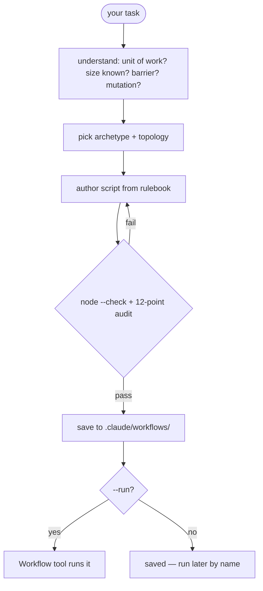

<p align="center">
  <b>weave</b> — author really good dynamic Workflow scripts on demand.<br/>
  <i>You name the task. Weave picks the topology, writes the script, and validates it.</i>
</p>

<p align="center">
  
  
</p>

---

## What it is

A Claude Code plugin that generates scripts for Claude's **Workflow tool** — the dynamic
multi-agent orchestrator that fans out subagents via `agent()`, `pipeline()`, `parallel()`,
and budget-driven loops. Writing a *good* Workflow script is mostly knowing the rules.
Weave bakes them into a generator.

```
/weave:make review the current diff for bugs and prove each finding is real
```

Weave classifies the task, picks the fan-out shape, authors a self-contained script, runs
`node --check` and a 12-point self-audit against it, and saves it to `.claude/workflows/`.

You name the task. It writes the orchestration.

---

## Mental model



The generator's bias matches the Workflow tool's own: **`pipeline()` by default, a barrier
only when one stage genuinely needs all prior results.** Most "separate stages" are
pipelines, not barriers — weave refuses to barrier without a named cross-item dependency.

---

## Commands

| command | what it does |
|---|---|
| `/weave:make <task> [--run] [--save=<name>] [--args=<json>]` | classify → shape → author → validate → save (and run with `--run`) |
| `/weave:help` | usage guide |

---

## The archetypes

| archetype | shape |
|---|---|
| **understand** | parallel readers per subsystem → one synthesis (barrier justified) |
| **design** | N approaches from different angles → judge panel → synthesize winner |
| **review** | dimensions in a pipeline, each finding adversarially verified as it lands |
| **research** | multi-modal sweep → deep-read → verify claims → cited synthesis |
| **migrate** | discover sites → transform each in a worktree → verify |
| **generic** | loop-until-dry / loop-until-budget for unknown-size work |

Compose freely — they're starting points, not a fixed menu.

---

## What makes a script "good" (the rules weave enforces)

- **Pure-literal `meta`** — no computed values in the literal, phase titles matched.
- **Pipeline by default** — `parallel()` only for a justified barrier (dedup, early-exit, cross-item compare).
- **`schema` for structured returns** — never `JSON.parse` agent text.
- **`.filter(Boolean)`** every fan-out result (skipped/thrown agents are `null`).
- **`isolation:'worktree'` only for parallel file mutation** — it's expensive.
- **Budget loops guarded on `budget.total`** — else they run to the agent cap.
- **No `Date.now()` / `Math.random()`** — they break resume and throw.
- **No silent caps** — any top-N / sampling is `log()`-ged.

Every generated script passes `node --check` and a 12-point self-audit before it's shown as
done. The full procedure lives in [`references/rulebook.md`](references/rulebook.md).

---

## Why running is opt-in

A workflow can spawn dozens of agents and burn a lot of tokens. `/weave:make` **authors and
saves** by default; it only **runs** the workflow when you pass `--run` or tell it to. Saved
workflows are parameterized over `args`, so they're reusable across runs — run now, run later
by name, or edit and re-run (or resume a paused run with `{scriptPath, resumeFromRunId}`).
